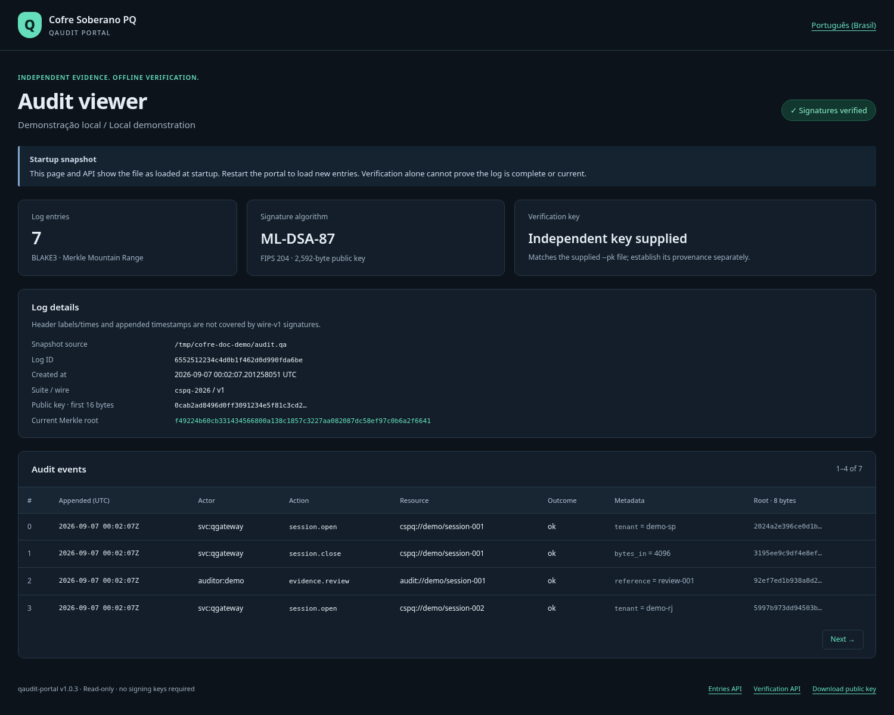
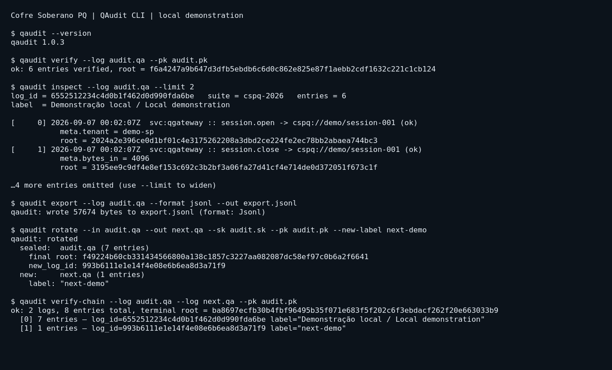
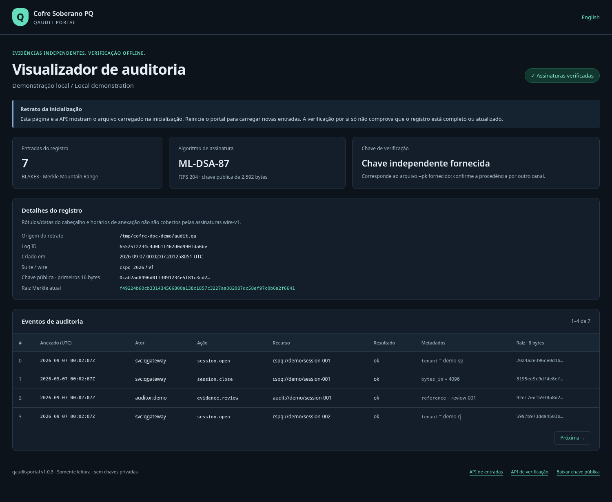
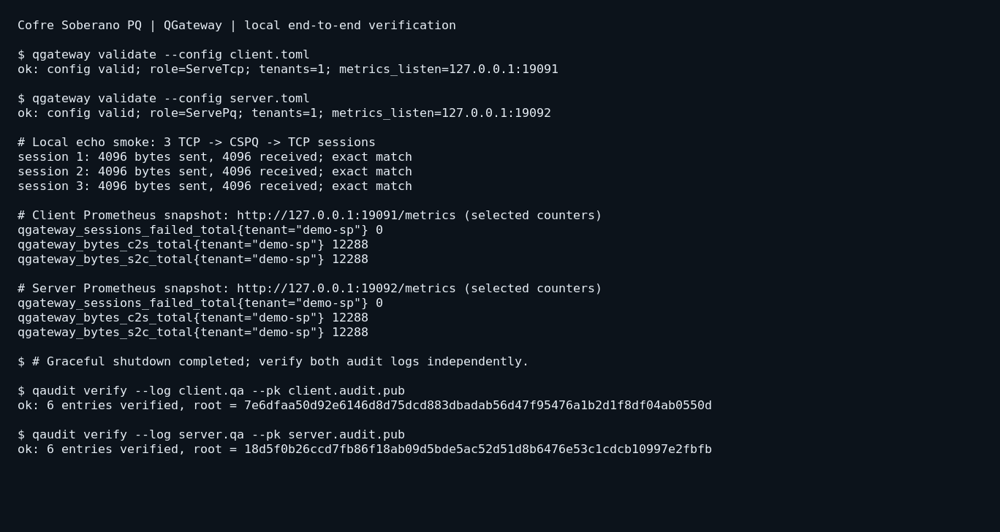

# Cofre Soberano PQ

> *Fronteira criptográfica pós-quântica para o Brasil regulado.*
>
> **Compress everything. Trust nothing. Encrypt always.**

🇧🇷 **Leia em português:** [README.pt-BR.md](README.pt-BR.md)

A monorepo for the **Cofre Soberano PQ (CSPQ)** product line — a post-quantum
cryptographic boundary for Brazilian regulated industries (banks, insurers,
healthcare, government). See [`SPEC.md`](./SPEC.md) for the full specification
and roadmap; this README focuses on what's in the box today.

## Screenshots

The screenshots below come from the running v1.0.3 tools using disposable
local demonstration keys and events. They illustrate the interface; they are
not evidence of production deployment, hardware certification, or an external audit.

| Audit viewer | Operational verification |
|---|---|
| [](screenshots/portal-en.png) | [](screenshots/qaudit-cli.png) |
| [](screenshots/portal-pt-BR.png) | [](screenshots/gateway-verification.png) |

[Mobile viewer](screenshots/portal-mobile.png) ·
[Invalid-signature example](screenshots/portal-invalid.png)

The portal supports `?lang=pt-BR` and `?offset=0&limit=50`; HTML pages are
limited to 200 entries. It serves a **startup snapshot**, including API
verification results. Restart it to load changes. Supply a trusted `--pk` to
check signer identity and put an authenticated proxy in front of any remote
access; the portal has no built-in authentication.


**Operator-facing documentation:**
- [`docs/RUNBOOK.md`](./docs/RUNBOOK.md) — production deployment, daily ops,
  signal contract, metrics reference, troubleshooting, incident response
- [`docs/HSM.md`](./docs/HSM.md) — PKCS#11 / HSM-backed audit-signer
  integration walkthrough
- [`docs/SMOKE_TEST.md`](./docs/SMOKE_TEST.md) — end-to-end production
  validation procedure (two hosts, real internet, audit chain cross-verified)
- [`CHANGELOG.md`](./CHANGELOG.md) — release history

If you're deploying the gateway in production, read `RUNBOOK.md` first.
If you're evaluating the product on real network conditions, start with
`SMOKE_TEST.md`. The SPEC is for understanding the design.

| Component  | Crate            | Status     | Description                                       |
|------------|------------------|------------|---------------------------------------------------|
| QAudit     | `qaudit-core`    | Sprint 2 ✅ | Library: PQ-signed Merkle audit log + XML/JSONL export |
| QAudit CLI | `qaudit`         | Sprint 2 ✅ | CLI to init / append / verify / inspect / export `.qa` logs |
| QAudit HSM | `qaudit-hsm`     | Sprint 2 ✅ | Signer trait substrate — soft + PKCS#11 (Dinamo / YubiHSM / Thales / nShield) |
| QAudit Portal | `qaudit-portal`| Sprint 2 ✅ | Axum read-only web viewer for auditors            |
| QTransport CSPQ | `qtransport-cspq` | Sprint 3 ✅ | Reference PQ transport: ML-KEM-1024 + ML-DSA-87 + ChaCha20-Poly1305 |
| QGateway Core | `qgateway-core` | Sprint 3 ✅ | Config, metrics, audit channel, bidirectional proxy substrate |
| QGateway   | `qgateway`       | Sprint 3 ✅ | TCP↔CSPQ reverse-proxy daemon (serve-tcp / serve-pq) |
| QVault     | —                | Deferred   | Not implemented in this repository; outside the current release scope |

---

## What QAudit is

A small, careful tool that produces an **offline-verifiable**, **append-only**,
**Merkle-chained**, **post-quantum-signed** audit log.

- **Algorithm:** ML-DSA-87 (FIPS 204) signatures, BLAKE3 Merkle Mountain Range.
- **File format:** single `.qa` binary, CBOR-encoded, magic-prefixed.
- **Trust model:** any party holding the log's public key can verify the entire
  chain without contacting the issuer — no network, no clock, no key escrow.
- **Scope:** cryptographic audit evidence for operator-defined workflows.
  The tool does not certify regulatory compliance, retention, trusted time,
  or an approved submission format. XML uses this project’s own schema.

---

## Quick start

```bash
# Build
cargo build --release --locked

# Initialize a new log + ML-DSA-87 keypair.
# By default, key files are named after the log: `audit.sk` and `audit.pk`,
# next to `audit.qa`. Pass `--sk PATH --pk PATH` to override.
./target/release/qaudit init --log audit.qa --label "compliance-prod-sp"

# Append events. --sk and --pk default to <log-stem>.sk and
# <log-stem>.pk next to the log; this example uses those defaults.
./target/release/qaudit append \
    --log audit.qa \
    --actor "svc:qgateway" --action "session.open" \
    --resource "gateway://prod/branch-sp/session-42" \
    --meta size_bytes=182734 --meta tenant=itau

# Verify (anyone with the .pk file can do this; no .sk needed)
./target/release/qaudit verify --log audit.qa --pk audit.pk

# Inspect (human-readable)
./target/release/qaudit inspect --log audit.qa --limit 10

# Inspect (machine-readable, NDJSON)
./target/release/qaudit inspect --log audit.qa --json

# Export to the project-defined QAudit XML schema v1
./target/release/qaudit export --log audit.qa --format xml --out export.xml

# Export to newline-delimited JSON for log aggregators (Splunk, Elastic, Wazuh)
./target/release/qaudit export --log audit.qa --format jsonl --out export.jsonl

# Read-only web portal for auditors (binds 127.0.0.1 by default)
./target/release/qaudit-portal --log audit.qa --pk audit.pk --listen 127.0.0.1:8080
# then open http://127.0.0.1:8080/ — also exposes /api/info, /api/entries, /api/verify
```

---

Each `.qa` file requires **one writer**. Do not run `qaudit append` or
`qaudit rotate` while a gateway or another process writes the same file.
Atomic replacement prevents partially rewritten files; it does not serialize
independent writers or prevent lost updates.

## HSM signing (production)

Software keys and optional PKCS#11 audit signing are implemented. Choose key
custody according to your deployment requirements. `qaudit-hsm` provides a
`Pkcs11Signer`; compatibility requires an ML-DSA-87 key and the exact mechanism
supported by your module. No named HSM has been certified by this project.
See [the compatibility limits](docs/HSM.md). Build the optional feature:

```bash
cargo build --release --locked -p qaudit-hsm --features pkcs11
```

The `Signer` trait in `qaudit_core` is the integration point:

```rust
use qaudit_hsm::{Pkcs11Config, Pkcs11Signer};
use qaudit_core::AuditLog;

let cfg = Pkcs11Config::new("/opt/dinamo/lib/libdinamo.so", 0, "audit-prod-key")
    .with_pin(std::env::var("HSM_PIN")?)
    .with_mechanism_id(0x8000_0001); // vendor-specific ML-DSA OID
let signer = Pkcs11Signer::open(cfg)?;
let log = AuditLog::create_with_signer(signer, "compliance-prod-sp")?;
```

This implementation defaults to the vendor-defined mechanism ID
`0x8000_0001`. It is a configurable placeholder, not a portable compatibility
guarantee. Set the ID from your vendor’s documentation and run the live
sign/verify test against the provisioned module.

---

## Verifying a log independently (auditor scenario)

A regulator receives `audit.qa` and `audit.pk` from the bank. They run:

```bash
qaudit verify --log audit.qa --pk audit.pk
```

Exit code `0` means the available entries pass signature and chain checks
under the supplied key. Establish the key’s provenance through a trusted
channel. Preserve an independently stored final root, entry count, and ordered
segment inventory to detect rollback or removal of complete trailing entries.

The wire-v1 header label, creation time, and per-entry `appended_at` timestamp
are not authenticated by entry signatures. Signed event timestamps are
producer assertions, not independent trusted time. `qaudit inspect` displays
contents without verifying them; `qaudit export` verifies against the embedded
key by default, but its XML is a project-defined format, not a regulator-approved
schema. Use `verify --pk` before sharing exports.

---

## QGateway — PQ reverse-proxy sidecar (Sprint 4)

QGateway tunnels arbitrary TCP traffic over the CSPQ post-quantum transport
(ML-KEM-1024 + ML-DSA-87 + ChaCha20-Poly1305). Two gateways run in a pair:
one in `serve-tcp` mode (accepts the local app's TCP, dials the peer over
CSPQ) and one in `serve-pq` mode (accepts inbound CSPQ from the peer, dials
the backend application). Every session emits signed `session.open` and
`session.close` audit events on both sides; metrics are exposed in
Prometheus text format with per-tenant labels.

**Sprint 4 introduces:** multi-tenant routing (one gateway, N isolated peer
pairs), persistent audit-key binding (`.audit.skid`), optional PKCS#11
audit signer, TLS 1.3 termination on the serve-tcp listen side, and a
graceful-close protocol (zero-length authenticated EOF marker).

```bash
# 1. Generate transport identity keys (one pair per gateway host).
qgateway keygen --sk /etc/qgateway/qg.skid --pk /etc/qgateway/qg.cspqid.pub

# 2. Generate an audit signer (the key that signs every entry in the .qa logs).
#    Keep .audit.skid as 0600; the .audit.pub is the artifact you give regulators.
qgateway audit-keygen \
  --sk /etc/qgateway/audit.skid \
  --pk /etc/qgateway/audit.pub

# 3. Exchange transport public keys per tenant. Each tenant has its own
#    /etc/qgateway/peers-<tenant>/ allow-list, so trust scopes are isolated.
mkdir -p /etc/qgateway/peers-sp /etc/qgateway/peers-rj
scp host-sp:/etc/qgateway/qg.cspqid.pub /etc/qgateway/peers-sp/host-sp.cspqid.pub
scp host-rj:/etc/qgateway/qg.cspqid.pub /etc/qgateway/peers-rj/host-rj.cspqid.pub

# 4. Multi-tenant config (serve-tcp side, with TLS termination on one tenant):
cat > /etc/qgateway/sidecar.toml <<'EOF'
role           = "serve-tcp"
identity_key   = "/etc/qgateway/qg.skid"
identity_pub   = "/etc/qgateway/qg.cspqid.pub"
metrics_listen = "127.0.0.1:9099"

[audit_signer]
kind       = "softkey"
secret_key = "/etc/qgateway/audit.skid"
public_key = "/etc/qgateway/audit.pub"

[[tenants]]
name         = "branch-sp"
listen       = "127.0.0.1:8443"
peer_pq      = "10.0.1.50:9999"
peer_pub_dir = "/etc/qgateway/peers-sp"
audit_log    = "/var/lib/qgateway/sp.qa"

# TLS 1.3 termination — local apps speak TLS to qgateway,
# qgateway promotes the link to CSPQ across the WAN.
[tenants.tls]
cert = "/etc/qgateway/tls/sp-server.pem"
key  = "/etc/qgateway/tls/sp-server.key"

[[tenants]]
name         = "branch-rj"
listen       = "127.0.0.1:8444"
peer_pq      = "10.0.2.50:9999"
peer_pub_dir = "/etc/qgateway/peers-rj"
audit_log    = "/var/lib/qgateway/rj.qa"
# (no [tenants.tls] block → plain TCP listener)
EOF

# 5. On the peer (serve-pq) host:
cat > /etc/qgateway/sidecar.toml <<'EOF'
role           = "serve-pq"
identity_key   = "/etc/qgateway/qg.skid"
identity_pub   = "/etc/qgateway/qg.cspqid.pub"
metrics_listen = "127.0.0.1:9099"

[audit_signer]
kind       = "softkey"
secret_key = "/etc/qgateway/audit.skid"
public_key = "/etc/qgateway/audit.pub"

[[tenants]]
name         = "branch-sp"
listen       = "0.0.0.0:9999"
backend      = "127.0.0.1:80"
peer_pub_dir = "/etc/qgateway/peers-sp"
audit_log    = "/var/lib/qgateway/sp.qa"
EOF

# 6. (Optional) PKCS#11-bound audit signer instead of softkey.
#    Rebuild the daemon with the pkcs11 feature:
cargo build -p qgateway --features pkcs11 --release
#    Then in the TOML, replace [audit_signer]:
cat <<'EOF'
[audit_signer]
kind         = "pkcs11"
module       = "/opt/dinamo/lib/libdinamo.so"
slot         = 0
pin_env      = "QGATEWAY_HSM_PIN"          # PIN is read from this env var
key_label    = "qgateway-audit-prod"
mechanism_id = 0x80000001                  # vendor-defined ML-DSA-87 OID
EOF

# 7. Run both gateways (systemd unit recommended):
QGATEWAY_HSM_PIN='…' qgateway run --config /etc/qgateway/sidecar.toml

# 8. Inspect operational state:
curl http://127.0.0.1:9099/healthz
curl http://127.0.0.1:9099/metrics | grep qgateway_
# Note: every metric now has a tenant="branch-sp" / tenant="branch-rj" label.

# 9. Verify audit logs per tenant:
qaudit verify  --log /var/lib/qgateway/sp.qa --pk /etc/qgateway/audit.pub
qaudit inspect --log /var/lib/qgateway/rj.qa --limit 20
```

Restarting the daemon preserves the audit chain: as long as the same
`.audit.skid` is configured, the log re-opens and new entries extend the
signed chain. The daemon refuses to extend a log whose header public key
doesn't match the configured audit signer (catches operator mistakes like
swapping audit keys without rotating the log file).

### Per-tenant audit keys (Sprint 5)

The top-level `[audit_signer]` block is a **default**, not a mandate.
Any tenant may override it with `[tenants.audit_signer]`:

```toml
[audit_signer]                     # daemon-level fallback
kind       = "softkey"
secret_key = "/etc/qgateway/audit-default.skid"
public_key = "/etc/qgateway/audit-default.pub"

[[tenants]]
name      = "regulated"
listen    = "127.0.0.1:8443"
peer_pq   = "10.0.1.50:9999"
peer_pub_dir = "/etc/qgateway/peers-regulated"
audit_log = "/var/lib/qgateway/regulated.qa"

# This tenant uses its OWN audit key in an HSM, not the default.
[tenants.audit_signer]
kind         = "pkcs11"
module       = "/opt/dinamo/lib/libdinamo.so"
slot         = 0
pin_env      = "QGATEWAY_HSM_PIN_REGULATED"
key_label    = "audit-regulated-prod"
mechanism_id = 0x80000001

[[tenants]]
name      = "internal"
listen    = "127.0.0.1:8444"
peer_pq   = "10.0.2.50:9999"
peer_pub_dir = "/etc/qgateway/peers-internal"
audit_log = "/var/lib/qgateway/internal.qa"
# (inherits the daemon-level default)
```

The strongest posture is to omit the top-level `[audit_signer]` entirely
and require every tenant to declare its own. With no fallback, accidental
inheritance becomes impossible:

```toml
# No top-level [audit_signer] — every tenant MUST declare one.

[[tenants]]
name      = "sp"
# ...
[tenants.audit_signer]
kind = "softkey"
secret_key = "/etc/qgateway/audit-sp.skid"
public_key = "/etc/qgateway/audit-sp.pub"

[[tenants]]
name      = "rj"
# ...
[tenants.audit_signer]
kind = "softkey"
secret_key = "/etc/qgateway/audit-rj.skid"
public_key = "/etc/qgateway/audit-rj.pub"
```

A compromise of one tenant's audit key (whether `.audit.skid` file or HSM
slot) does not let an attacker forge entries in another tenant's log. For
regulators auditing a single tenant, give them just that tenant's
`.audit.pub` — they can verify the full chain without ever seeing any
other tenant's data.

### Cert hot-reload (Sprint 5.5)

Cert rotations (Let's Encrypt every 90 days, corporate CA on annual
cadence, ACME short-lived certs every hour) don't require a gateway
restart. After your renewal tool atomically replaces the cert + key
files, send the daemon SIGUSR1:

```bash
$ certbot renew   # or your equivalent renewal workflow
$ kill -USR1 $(pidof qgateway)
```

The daemon walks every TLS-enabled tenant, re-reads its `[tenants.tls]`
cert + key from disk, builds a fresh `TlsAcceptor`, and atomically
installs it. In-flight handshakes finish on the previous acceptor (no
mid-handshake swap, which would corrupt state). The *next* accept on
each tenant picks up the new cert.

If a reload fails (typo in path, bad PEM, partial write during atomic
rename), the daemon logs `TLS reload FAILED, keeping previous cert: …`
and keeps serving on the old cert. Fix the underlying issue and re-send
SIGUSR1; there is no traffic interruption either way.

### SNI tenant routing (Sprint 6)

Multiple tenants can share a single TLS listen port and be dispatched by
SNI hostname at handshake time. Each tenant declares its own SNI and its
own cert; the gateway builds one shared `TlsAcceptor` with a multi-SNI
cert resolver. Strict isolation — unknown SNIs receive a TLS
`unrecognized_name` alert with no fallback cert.

```toml
[audit_signer]
kind = "softkey"
secret_key = "/etc/qgateway/audit.skid"
public_key = "/etc/qgateway/audit.pub"

# Both tenants share 0.0.0.0:8443 — implicit SNI group.

[[tenants]]
name      = "sp"
listen    = "0.0.0.0:8443"
sni       = "sp.example.com"
peer_pq   = "10.0.1.50:9999"
peer_pub_dir = "/etc/qgateway/peers-sp"
audit_log = "/var/lib/qgateway/sp.qa"
[tenants.tls]
cert = "/etc/qgateway/tls/sp.pem"
key  = "/etc/qgateway/tls/sp.key"

[[tenants]]
name      = "rj"
listen    = "0.0.0.0:8443"
sni       = "rj.example.com"
peer_pq   = "10.0.2.50:9999"
peer_pub_dir = "/etc/qgateway/peers-rj"
audit_log = "/var/lib/qgateway/rj.qa"
[tenants.tls]
cert = "/etc/qgateway/tls/rj.pem"
key  = "/etc/qgateway/tls/rj.key"
```

Validation rules enforced at config load time:

- Tenants sharing a `listen` MUST all declare distinct `sni` hostnames
  AND must all have `[tenants.tls]` set.
- A single-tenant listener (no siblings) MUST NOT have `sni` set —
  it's a useless field and the false sense of routing isolation is a
  config smell.
- Duplicate SNI hostnames inside one group → error.
- Mixed TLS-on / TLS-off members in one group → error.

**Wildcard SNI** (Sprint 8): a tenant can declare `sni = "*.host.example.com"`
to match every single-label subdomain (`api.host.example.com`,
`www.host.example.com`, …) but not multi-label (`x.y.host.example.com`)
nor the bare suffix (`host.example.com`). Pattern shape is strict —
only `*.` as the leftmost label is accepted; mid-string asterisks
(`a.*.com`) and dotless wildcards (`*foo`) are rejected at config
load. Exact SNI matches always win over wildcards, so you can declare
both `priority.example.com` (exact) and `*.example.com` (catchall) in
the same listener and the resolver will route correctly.

The same `[tenants.audit_signer]` per-tenant override (Sprint 5) and
hot-reload (Sprint 5.5 for single-tenant TLS, Sprint 6.5 for SNI groups
— SIGUSR1 atomically rebuilds the whole multi-SNI resolver) all
continue to work alongside SNI grouping.

Handshake p50 on commodity hardware: ~3 ms.

---

## Audit log rotation chain (Sprint 7)

A long-running gateway can rotate its `.qa` audit log without
breaking cryptographic chain integrity. Each rotated file carries:

- A `prev_log_id` in its header referencing the predecessor's log id.
- A `prev_log_final_root` in its header — the predecessor's MMR root
  *after* its final `audit.rotation_close` event. This is the
  cryptographic link that makes silent deletion of intermediate logs
  detectable.
- An `audit.rotation_open` event as its FIRST entry, re-asserting the
  predecessor references in metadata. Signed under the new log's key.

The predecessor's LAST event is `audit.rotation_close` with metadata
pointing forward to the new log's id. Signed under the old log's key.

```rust
// Programmatic rotation:
let (sealed_old, new_open) = old_log.rotate_to(
    new_signer,                    // Box<dyn Signer>; can be same or different key
    "audit-2026-02",               // human-readable label for the new log
    "",                            // empty → random new log id (or pass hex to pin)
)?;
sealed_old.save_to("audit-2026-01.qa")?;
// new_open is open for appending. Save it on shutdown.
```

Verifying a multi-file chain:

```rust
// A regulator has the audit pubkey(s) and the chain on disk.
let a = AuditLog::open("audit-2026-01.qa")?;
let b = AuditLog::open("audit-2026-02.qa")?;
let c = AuditLog::open("audit-2026-03.qa")?;
AuditLog::verify_chain(&[&a, &b, &c])?;   // walks all 6 integrity properties
```

`verify_chain` enforces:

1. Each log's internal signature chain is valid (per-log `verify`).
2. The first log in the slice has no `prev_log_id` (operator-error
   guard against passing logs out of order).
3. The predecessor's last event is `audit.rotation_close` with
   `metadata.new_log_id` matching the next log's actual id.
4. The next log's `header.prev_log_id` matches the predecessor's id.
5. The next log's `header.prev_log_final_root` matches the
   predecessor's actual computed MMR root (after rotation_close).
6. The next log's first event is `audit.rotation_open` with
   consistent metadata.

Failures identify the specific log id and the specific property that
broke. **Cross-key rotation is supported** — rotating the audit key
at the same moment as the file rotation is a single coherent
operation; each log segment is verified under its own header pubkey.

---

## Audit rotation CLI (Sprint 7.5)

The `qaudit` CLI ships two subcommands for offline rotation
operations:

```bash
# Offline rotation: seal current log, create successor.
qaudit rotate \
    --in     audit-current.qa \
    --out    audit-2026-02.qa \
    --sk     audit.skid \
    --pk     audit.pub \
    --new-label "audit-2026-02"

# Multi-file chain verification (regulator workflow):
qaudit verify-chain \
    --log audit-2025-12.qa \
    --log audit-2026-01.qa \
    --log audit-2026-02.qa \
    --pk  audit.pub
```

`qaudit rotate` modifies the input file in place (appending the
`rotation_close` sentinel) and creates the output file with
`rotation_open` as its first event. The same audit key signs both
events — for cross-key rotation, use the library API directly.

`qaudit verify-chain` walks every adjacent pair, enforcing the six
integrity properties from Sprint 7. Omit `--pk` to verify a cross-key
chain (each segment checked under its own header pubkey); pass `--pk`
to require a single key across the entire chain.

Until Sprint 7.6 wires auto-rotation into the daemon, operators can
schedule rotation via cron:

```cron
# Monthly at 02:00 on the first day:
0 2 1 * * /usr/local/bin/qaudit rotate \
    --in /var/lib/qg/sp-current.qa \
    --out /var/lib/qg/archive/sp-$(date +%%Y-%%m).qa \
    --sk /etc/qg/audit.skid --pk /etc/qg/audit.pub \
    --new-label "sp-$(date +%%Y-%%m)" \
    && systemctl restart qgateway
```

The restart-time gap is typically sub-second under systemd; for
typical monthly-rotation cadences this is operationally acceptable.

---

## Auto-rotation in the daemon (Sprint 8 / 8.5)

Sprint 8 added a `RotationPolicy` config schema, an `AuditChannel::rotate()`
API, and a SIGUSR2 signal handler that fans rotation requests across all
tenants whose audit signer supports it (Softkey today; PKCS#11 in Sprint 9).
Sprint 8.5 closed the auto-rotation gap with a background monitor task per
tenant that fires `request_rotation_silent` when configured thresholds cross.

```toml
# /etc/qgateway/sidecar.toml
[rotation]
max_entries     = 100_000     # rotate after 100k events
max_bytes       = 134_217_728 # OR after segment exceeds 128 MiB
max_age_secs    = 86_400      # OR after 24h
archive_pattern = "{label}-{ts}-{counter}.qa"
```

Any one of `max_entries`, `max_bytes`, or `max_age_secs` is enough to enable
the monitor — the first to cross wins. The monitor polls at 5s. `{label}`
is the tenant name, `{ts}` is `YYYYMMDDTHHMMSSZ`, `{counter}` is a
monotonic per-tenant integer starting at 1. Both SIGUSR2 and the monitor
share the same counter, so the archive sequence is contiguous regardless
of which path fired.

`max_bytes` is best-effort (batched saves mean the file can briefly exceed
the threshold by up to one batch worth of events). For hard caps prefer
`max_entries` (exact) or `max_age_secs` (monotonic with wall clock). The
`qgateway_audit_rotations_total` metric tracks successful rotations per
tenant; failed rotations log at error level and keep the previous log
open.

SIGUSR2 still works alongside the monitor:

```bash
$ kill -USR2 $(pidof qgateway)
[INFO  qgateway] SIGUSR2 received, rotating audit logs (n_tenants=2)
[INFO  qgateway] audit rotation requested tenant=sp archive=/var/lib/qg/sp-20260520T010843Z-1.qa
[INFO  qgateway] audit rotation requested tenant=rj archive=/var/lib/qg/rj-20260520T010843Z-1.qa
```

---

## HSM rotation + cross-key rotation (Sprint 9)

PKCS#11-backed audit signers now rotate the same way Softkey signers do.
The new `Pkcs11SignerFactory` opens a fresh HSM session per rotation
(typically <100ms on local Dinamo; longer on networked HSMs). Zero
downtime, zero key change — only the file is rotated.

For incident response — when an audit key is suspected compromised —
`qaudit rotate` accepts `--new-sk` and `--new-pk` for cross-key rotation:

```bash
qaudit rotate \
    --in   /var/lib/qg/audit-current.qa \
    --out  /var/lib/qg/audit-2026-q2.qa \
    --sk   /etc/qg/audit-2026-q1.skid \
    --pk   /etc/qg/audit-2026-q1.pub \
    --new-sk /etc/qg/audit-2026-q2.skid \
    --new-pk /etc/qg/audit-2026-q2.pub \
    --new-label "audit-2026-q2"
```

The `rotation_close` sentinel is signed under the OLD key. The new
log's `rotation_open` + every subsequent event is signed under the
NEW key. `verify_chain` validates each segment under its own header
pubkey — DO NOT pass `--pk` when verifying a cross-key chain.

Cross-key rotation is intentionally CLI-only (no SIGUSR2 / no monitor
trigger). It's an offline operator action; auto-triggering a key
swap would defeat the audit-trail forensics it exists to enable.

---

## Connection admission control (Sprint 9.5)

Per-tenant quota + per-source-IP token-bucket rate limit, configured
in TOML, evaluated on the accept hot path BEFORE handshakes. Both
opt-in — tenants without `[limits]` blocks see zero behavioral change.

```toml
[[tenants]]
name = "sp"
listen = "0.0.0.0:8443"
sni = "sp.bank.example.com"
# ... other tenant fields ...

[tenants.limits]
max_concurrent = 500       # at most 500 in-flight sessions for this tenant

[tenants.limits.rate_limit_per_source]
capacity        = 20       # burst of 20 conns from one source IP
refill_per_sec  = 5        # then 5 conns/sec sustained
```

Rejected connections are dropped with TCP RST. No handshake cost
paid on rejected connections to single-tenant listeners. SNI groups
pay TLS-handshake cost before knowing which tenant's limits apply
(documented limitation; for hard pre-handshake protection on shared
ports, deploy a layer-4 limiter upstream).

Observability:

```text
qgateway_admission_rejected_quota_total{tenant="sp"} 47
qgateway_admission_rejected_rate_total{tenant="sp"}  213
```

Quota saturation suggests scaling out or raising `max_concurrent`;
sustained rate rejections suggest abuse — cross-reference with
access logs to identify the source IP. Buckets are per-tenant
per-source — different tenants don't share state.

Sprint 10.5 adds a lazy GC sweep: when a tenant's per-source bucket
map grows past 8192 entries, every accept evaluates the map and drops
entries that are both (a) refilled to capacity AND (b) idle longer
than 5 minutes. Memory stays bounded at `8192 + 300 * arrival_rate`
entries; for sustained 1k sources/min the steady-state is ~13k entries
(~650 KiB), independent of cumulative connections.

---

## HSM observability (Sprint 10)

PKCS#11 audit signers now report session lifecycle and signing events
as Prometheus counters. Operators see HSM failures within the next
scrape interval instead of by tailing tracing logs.

```text
qgateway_hsm_sessions_opened_total{tenant="sp"} 4
qgateway_hsm_sessions_failed_total{tenant="sp"} 0
qgateway_hsm_sign_ops_total{tenant="sp"}        18742
qgateway_hsm_sign_failures_total{tenant="sp"}   0
```

Suggested alerts:

```yaml
- alert: QGatewayHsmSessionsFailing
  expr: rate(qgateway_hsm_sessions_failed_total[5m]) > 0
  for: 1m
- alert: QGatewayHsmSignFailing
  expr: |
    rate(qgateway_hsm_sign_failures_total[5m]) > 0
    and on (tenant) rate(qgateway_hsm_sessions_opened_total[5m]) == 0
  for: 30s
```

Sign failures with no concurrent session-open failures indicate the
live session is rejecting signs (token disconnected mid-session,
mechanism unsupported after firmware update). Session-open failures
indicate broader outage (PIN expired, slot unreachable, driver
issue).

Softkey deployments leave these counters at 0 — they only move when
a PKCS#11 signer is configured.

---

## SIGHUP runtime tenant lifecycle (Sprints 11.0 → 13)

Operators add new tenants and detect configuration changes on the
running daemon without a full restart.

```bash
$ cat >> /etc/qgateway/sidecar.toml <<EOF

[[tenants]]
name         = "branch-bahia"
listen       = "0.0.0.0:8447"
peer_pq      = "10.0.5.10:9999"
peer_pub_dir = "/etc/qg/peers-bahia"
audit_log    = "/var/lib/qg/bahia.qa"
EOF

$ kill -HUP $(pidof qgateway)

[INFO  qgateway] SIGHUP received config="/etc/qgateway/sidecar.toml"
[INFO  qgateway] config reload diff
                added=1 removed=0 unchanged=3 config_changed=0
[INFO  qgateway] tenant="branch-bahia" role=ServeTcp
                "tenant ADDED at runtime — serving traffic"
```

When an operator edits an existing tenant's settings, SIGHUP reports
the specific fields that changed, classified as **Hot** (applied
without restart) or **Cold** (requires restart):

```bash
# Operator raises branch-sp's limits.max_concurrent from 100 to 200.
$ kill -HUP $(pidof qgateway)
[INFO  qgateway] tenant="branch-sp" fields=["limits"] kind="hot"
                "tenant limits hot-applied (new policy in effect for future
                 connections; in-flight permits unaffected)"
[INFO  qgateway] config reload diff
                added=0 removed=0 unchanged=4
                config_changed_hot=1 config_changed_cold=0
```

Hot apply (Sprint 16) atomically swaps the tenant's
`AdmissionController` without restarting the accept loop. In-flight
permits from the OLD controller remain valid — existing sessions
complete naturally — and NEW connections count against the new policy.
Per-source rate-limit buckets reset on swap (a deliberate choice: an
operator tightening rate limits as abuse-mitigation should NOT use a
limits edit — that's a tenant remove operation, Sprint 17+).

Cold changes still require restart and are reported separately:

```bash
[WARN  qgateway] tenant="branch-sp" fields=["listen"] kind="cold"
                "tenant configuration changed (cold-only, restart required)"
```

The split lets operators triage:

- Hot only → policy applied automatically; no action needed
- Any cold → must restart now or roll back the edit

Sprint 17 adds Prometheus counters for the SIGHUP path so this triage
can be automated:

```text
qgateway_sighup_cycles_total                 # successful SIGHUP cycles
qgateway_sighup_failed_total                 # validation failures
qgateway_tenants_added_total                 # runtime ADDs
qgateway_tenants_add_failed_total            # ADD failures
qgateway_tenants_removed_total               # runtime REMOVEs (Sprint 18)
qgateway_tenants_remove_failed_total         # REMOVE drain timeouts (Sprint 18)
qgateway_limits_hot_applied_total            # hot-applied limits edits
qgateway_config_changed_hot_total            # diff entries (Hot)
qgateway_config_changed_cold_total           # diff entries (Cold)
```

Alert on `rate(qgateway_sighup_failed_total[15m])` for bad TOML in
production; alert on `increase(qgateway_config_changed_cold_total[1h])`
for configuration drift (cold changes piling up without restart).

### Tenant removal at runtime (Sprint 18)

Plain serve-tcp single tenants and all serve-pq tenants can be removed
without restarting the daemon. Edit the TOML to drop the `[[tenants]]`
block and SIGHUP:

```bash
$ kill -HUP $(pidof qgateway)
[INFO  qgateway] tenant="branch-bahia" "tenant drained and removed"
[INFO  qgateway] config reload apply summary
                added_applied=0 added_failed=0
                removed_applied=1 removed_failed=0
```

The drain protocol notifies only the targeted tenant's accept loop;
in-flight sessions of OTHER tenants are untouched. The default drain
timeout is 30s — sessions that don't honor cancellation in that window
trigger a `tenants_remove_failed_total` bump and leave the entry in
the shared maps (daemon restart required for full cleanup).

Sprint 19 makes the drain timeout operator-configurable via TOML:

```toml
# Top-level config (sidecar.toml)
tenant_drain_timeout_secs = 60   # default 30
```

Sprint 19 also adds a graceful audit-channel drain. After the accept
loop exits, the daemon calls `AuditChannel::shutdown_async()` on the
tenant's audit channel BEFORE purging it from the shared map. The
writer task flushes its in-memory buffer to disk and exits cleanly:

```bash
[INFO  qgateway] tenant="branch-bahia"
                "tenant drained and removed (audit channel flushed)"
```

Sprint 18 left the audit channel cleanup as best-effort (Drop-based);
Sprint 19 closes that gap.

### TLS-enabled tenants at runtime (Sprint 20)

Sprint 20 closes the last per-tenant lifecycle gap: TLS-enabled single
tenants can now be ADDED and REMOVED at runtime via SIGHUP, just like
plain TCP and serve-pq tenants. The previous Sprint-18 restriction
("TLS-enabled single tenants are NOT individually removable") is gone.

Adding a TLS-enabled tenant:

```toml
# /etc/qgateway/sidecar.toml
[[tenants]]
name = "branch-new"
listen = "127.0.0.1:9445"
peer_pq = "peer.example.com:9000"
peer_pub_dir = "/etc/qgateway/peers"
audit_log = "/var/log/qgateway/branch-new.qa"

[tenants.tls]
cert = "/etc/qgateway/certs/branch-new.crt"
key = "/etc/qgateway/keys/branch-new.key"
```

```bash
$ kill -HUP $(pidof qgateway)
[INFO  qgateway] tenant="branch-new" "TLS termination + hot-reload enabled (runtime add)"
[INFO  qgateway] tenant="branch-new" "tenant ADDED at runtime — serving traffic"

# The new tenant's cert is now in the SIGUSR1 reload set:
$ kill -USR1 $(pidof qgateway)
[INFO  qgateway] tenant="branch-new" "TLS cert reloaded"
```

Removing a TLS-enabled tenant:

```bash
$ kill -HUP $(pidof qgateway)
[INFO  qgateway] tenant="branch-new" "tenant drained and removed (audit channel flushed)"
[INFO  qgateway] tenant="branch-new" "TLS reload trigger purged"
```

**Cumulative runtime lifecycle (Sprint 20)**:

| Tenant kind | ADD | Hot-reconfigure limits | REMOVE | TLS cert reload |
|---|---|---|---|---|
| serve-pq | ✅ | ✅ | ✅ | N/A |
| serve-tcp (plain TCP) | ✅ | ✅ | ✅ | N/A |
| serve-tcp (TLS-single) | ✅ | ✅ | ✅ | ✅ (SIGUSR1) |
| serve-tcp (SNI group) | ❌ restart | ✅ | ❌ restart | ✅ (SIGUSR1) |

Only SNI multi-tenant group ADD/REMOVE still requires daemon restart
(shared listener, mutable dispatch table — Sprint 21+ work).

### SNI dispatch hot-swap infrastructure (Sprint 21–22)

Sprint 21 added `HotSniDispatchTable` — an `arc_swap`-backed wrapper
around `SniDispatchTable` with immutable-builder methods
`with_tenant_added` and `with_tenant_removed`.

Sprint 22 wired it through:

- `run_sni_group` now accepts `Arc<HotSniDispatchTable>`. Per-session
  task does `dispatch.load().lookup(&sni)` exactly once just after
  TLS handshake. Concurrent dispatch swaps are invisible to in-flight
  sessions (Arc guard semantics).
- `TlsReloadTrigger` for multi-SNI groups now exposes
  `add_sni_entry(label, sni, cfg)`, `remove_sni_entry(label)`, and
  `sni_labels()`. Each mutation rebuilds the rustls multi-SNI
  acceptor and atomically swaps it via the existing watch channel.
  Rollback on rebuild failure keeps the trigger's state consistent
  with what's actually serving.

The SIGHUP arm wiring — using these two APIs to add/remove SNI
tenants from running groups without restarting the daemon — landed
in Sprint 23. See below.

### SNI tenants at runtime (Sprint 23)

Sprint 23 composes the Sprint 21 + 22 infrastructure into operator-
visible behavior: SIGHUP can now add a tenant to a running SNI
group, or remove one, without restarting the daemon.

Adding an SNI tenant to a running group:

```toml
# /etc/qgateway/sidecar.toml — operator adds carol to an SNI group
# already serving alice + bob on 127.0.0.1:9000:
[[tenants]]
name = "carol"
listen = "127.0.0.1:9000"          # same listen as alice/bob
peer_pq = "peer.example.com:9001"
peer_pub_dir = "/etc/qgateway/peers"
audit_log = "/var/log/qgateway/carol.qa"
sni = "carol.example.com"

[tenants.tls]
cert = "/etc/qgateway/certs/carol.crt"
key = "/etc/qgateway/keys/carol.key"
```

```bash
$ kill -HUP $(pidof qgateway)
[INFO  qgateway] tenant="carol" listen=127.0.0.1:9000 sni=carol.example.com
                "SNI tenant added at runtime — joining existing group"
```

Removing an SNI tenant from a group:

```bash
$ kill -HUP $(pidof qgateway)
[INFO  qgateway] tenant="carol" listen=127.0.0.1:9000
                "SNI tenant removed at runtime (in-flight sessions continue under old context until natural end)"
```

REMOVE is soft-drain: new TLS handshakes for the removed SNI fail
immediately (cert no longer in resolver, dispatch no longer maps the
hostname), but in-flight sessions that already resolved their context
continue under that tenant's identity until they end naturally. Hard
drain via per-SNI-tenant `Arc<Notify>` is Sprint 24+ work.

**Cumulative runtime lifecycle (Sprint 23)**:

| Tenant kind | ADD | Hot-reconfigure limits | REMOVE | TLS cert reload |
|---|---|---|---|---|
| serve-pq | ✅ | ✅ | ✅ | N/A |
| serve-tcp (plain TCP) | ✅ | ✅ | ✅ | N/A |
| serve-tcp (TLS-single) | ✅ | ✅ | ✅ | ✅ (SIGUSR1) |
| serve-tcp (SNI in existing group) | ✅ | ✅ | ✅ | ✅ (SIGUSR1) |
| New SNI group (first tenant on new listen) | ❌ restart | N/A | N/A | N/A |

### SNI group lifecycle at runtime (Sprint 24)

Sprint 24 closes the final lifecycle gap. The daemon can now spawn a
new SNI group on a previously-unused listen address, and drain a
group when its last tenant leaves — both via SIGHUP, no restart.

Adding the first tenant on a brand-new SNI listen:

```toml
# Operator adds an SNI tenant on a listen no other tenant uses:
[[tenants]]
name = "branch-east"
listen = "127.0.0.1:9100"
peer_pq = "peer.example.com:9101"
peer_pub_dir = "/etc/qgateway/peers"
audit_log = "/var/log/qgateway/branch-east.qa"
sni = "branch-east.example.com"

[tenants.tls]
cert = "/etc/qgateway/certs/branch-east.crt"
key = "/etc/qgateway/keys/branch-east.key"
```

```bash
$ kill -HUP $(pidof qgateway)
[INFO  qgateway] tenant="branch-east" "SNI tenant added at runtime — new group spawned"
[INFO  qgateway] listen=127.0.0.1:9100 n_tenants=1
                "SNI multi-tenant listener active (hot-swappable dispatch)"
```

Removing the last tenant from a group:

```bash
$ kill -HUP $(pidof qgateway)
[INFO  qgateway] tenant="branch-east" "SNI tenant removed at runtime ..."
[INFO  qgateway] listen=127.0.0.1:9100 "SNI group empty after remove — draining"
[INFO  qgateway] listen=127.0.0.1:9100 "SNI group drained cleanly"
[INFO  qgateway] listen=127.0.0.1:9100 "SNI group purged from shared state"
# Port 9100 is now free.
```

**Cumulative runtime lifecycle (Sprint 24 — 100% green)**:

| Tenant kind | ADD | Hot-reconfigure limits | REMOVE | TLS cert reload |
|---|---|---|---|---|
| serve-pq | ✅ | ✅ | ✅ | N/A |
| serve-tcp (plain TCP) | ✅ | ✅ | ✅ | N/A |
| serve-tcp (TLS-single) | ✅ | ✅ | ✅ | ✅ (SIGUSR1) |
| serve-tcp (SNI in existing group) | ✅ | ✅ | ✅ | ✅ (SIGUSR1) |
| **New SNI group (first tenant on new listen)** | **✅ Sprint 24** | N/A | **✅ Sprint 24** | ✅ (SIGUSR1) |

The daemon supports zero-downtime ADD / hot-reconfigure / REMOVE /
cert-reload for every tenant kind. No restart is required for any
per-tenant or per-group lifecycle event short of binary upgrade.

### End-to-end integration test (Sprint 25)

Sprint 25 ships the first integration test that drives a real qgateway
subprocess through a complete SIGHUP lifecycle:

```bash
$ cargo test -p qgateway --test sighup_integration
running 1 test
test sighup_add_then_remove_tenant_increments_counters ... ok

test result: ok. 1 passed; 0 failed; finished in 4.61s
```

The test:
1. Spawns the qgateway binary with a 1-tenant config.
2. Waits for `/metrics` to come up.
3. Modifies the config to add a second tenant, sends SIGHUP, asserts
   `qgateway_tenants_added_total` incremented.
4. Modifies the config back to remove the added tenant, sends SIGHUP,
   asserts `qgateway_tenants_removed_total` incremented.
5. SIGTERM, verifies clean shutdown via Drop guard.

Sprint 25's scope is deliberately one tenant kind (`serve-pq`); the
test harness generalizes to TLS-single, SNI-in-existing-group, and
new-SNI-group scenarios — adding them is mechanical work in
subsequent sprints. See SPEC §13.33 for details.

### Audit chain integrity across SIGHUP cycles (Sprint 26)

Sprint 26 adds a second integration test proving the compliance
invariant: every per-tenant audit log file is a valid signed chain
after the tenant goes through SIGHUP lifecycle events.

```bash
$ cargo test -p qgateway --test audit_chain_integrity
running 2 tests
test audit_chains_remain_valid_across_sighup_cycle ... ok
test audit_chains_verify_against_provided_pubkey ... ok

test result: ok. 2 passed; 0 failed; finished in 9.93s
```

The tests prove:
1. Tenant audit logs parse + verify at every lifecycle event
   (startup, mid-SIGHUP-cycle, after REMOVE, after SIGTERM).
2. A tenant added at runtime (via SIGHUP ADD) creates a chain whose
   header carries the correct signer pubkey.
3. A tenant removed at runtime (via SIGHUP REMOVE) has its audit
   channel's `shutdown_async` flush cleanly — the resulting file
   still parses + verifies after the tenant is gone.
4. External verification (loading the published `.audit.pub` from
   disk separately) produces bit-for-bit matching pubkeys — the
   path a compliance auditor would take.

This is the first test that exercises the **audit-write half of the
daemon end-to-end inside the live signal-driven loop**. All prior
audit tests (48 in qaudit-core) cover the chain machinery in
isolation; this one covers it in production conditions.

### Audit rotation + SIGHUP interaction (Sprint 27)

Sprint 27 added two integration tests for the SIGUSR2 ↔ SIGHUP
interaction. Writing the tests surfaced a real bug: the daemon's
`rotation_targets` was a startup-populated `Vec` that never grew on
SIGHUP ADD, so any tenant added at runtime would be silently skipped
by SIGUSR2 rotation.

Sprint 27 ships both the test AND the fix:

- **Fix**: `rotation_targets` promoted to `Arc<RwLock<HashMap<...>>>`.
  SIGHUP ADD inserts, REMOVE purges. SIGUSR2 reads via snapshot.
- **Test 1**: `sigusr2_rotates_runtime_added_tenant` adds `bob` via
  SIGHUP, then SIGUSR2, then asserts a `bob-*.qa` archive file
  exists and verifies. This was the bug-catching test.
- **Test 2**: `sigusr2_skips_removed_tenants` removes a tenant, then
  SIGUSR2, then asserts no NEW archive file appears for the removed
  tenant. Locks in the dual invariant.

```bash
$ cargo test -p qgateway --test rotation_sighup_integration
running 2 tests
test sigusr2_rotates_runtime_added_tenant ... ok
test sigusr2_skips_removed_tenants ... ok

test result: ok. 2 passed; 0 failed; finished in 10.53s
```

This is exactly the bug class integration tests are designed to
catch: every lib test passed, every prior integration test passed,
manual review missed it, the lifecycle matrix was "100% green" — but
a 16-sprint-old `Vec` had quietly diverged from the Sprint 20+
HashMap pattern used everywhere else. The test caught it in one run.
See SPEC §13.35 for the full post-mortem.

### Auto-rotation monitor for runtime-added tenants (Sprint 28)

Sprint 28 closes the companion bug that Sprint 27 disclosed. Where
Sprint 27 fixed the SIGUSR2 path's `rotation_targets` Vec, Sprint 28
fixes the per-tenant `RotationMonitor` task that auto-triggers
rotation based on `[rotation] max_bytes`/`max_age_secs`/`max_entries`
thresholds. Pre-Sprint-28, runtime-added tenants got their SIGUSR2
support (Sprint 27 fix) but no auto-rotation monitor — operators
with size-based or age-based policies who added tenants via SIGHUP
would see those tenants' logs grow past the configured thresholds.

```bash
$ cargo test -p qgateway --test auto_rotation_runtime_tenant
running 2 tests
test auto_rotation_fires_for_runtime_added_tenant ... ok
test auto_rotation_monitor_stopped_on_remove ... ok

test result: ok. 2 passed; 0 failed; finished in 35.22s
```

The fix follows the same pattern as Sprint 27: `monitor_handles`
promoted from startup-populated `Vec` to `Arc<RwLock<HashMap>>`;
spawn on SIGHUP ADD; drain on SIGHUP REMOVE. The monitor now also
listens to the per-tenant shutdown `Notify` instead of the daemon-
wide one, so REMOVE can stop just that tenant's monitor.

Sprint 28 also fixed a latent task leak — the pre-Sprint-28 `Vec`
of monitor handles was never drained at SIGTERM. See SPEC §13.36.4
for the full post-mortem.

### Chaos test of the SIGHUP arm (Sprint 29)

Sprint 29 adds a single chaos integration test that drives the
daemon through 30 randomised operations interleaving SIGHUP-ADD,
SIGHUP-REMOVE, SIGHUP-no-change, SIGUSR1 (TLS reload) and SIGUSR2
(audit rotation), then asserts terminal invariants.

```bash
$ cargo test -p qgateway --test chaos_signal_sequence
running 1 test
test chaos_signal_sequence_preserves_invariants ... ok

test result: ok. 1 passed; 0 failed; finished in 7.73s
```

What's exercised:
- SIGUSR1 fired while a SIGHUP-spawned tenant is mid-bootstrap
- SIGUSR2 rotation issued mid-SIGHUP-remove
- SIGHUP-no-change exercising the "everything unchanged" diff branch
- Random interleaving of all five signal flavors

Invariants asserted:
- `/metrics` responds at every step (no daemon crash, no deadlock)
- Prometheus counters monotonic at every step
- Counter deltas bounded by operations issued (no over- or
  under-counting beyond 80% signal-coalescing tolerance)
- Every surviving tenant's audit chain verifies post-run

The test uses a deterministic LCG (Numerical Recipes constants)
with a fixed seed, so failures are reproducible. It is NOT a true
property-based test with shrinking — see SPEC §13.37.3 for honest
limitations and §13.37.7 for what's deferred to Sprint 30+.

### Audit chain for non-empty chains under real session load (Sprint 30)

Sprint 30 closes the biggest "unknown unknown" carried since
Sprint 26: every prior audit chain integration test exercised
EMPTY chains (just the header). Sprint 30 drives real CSPQ sessions
through a `serve-pq` tenant, so the daemon emits actual
`session.open` + `session.close` events to its audit log, and the
test then verifies the non-empty signed chain.

```bash
$ cargo test -p qgateway --test session_events_audit
running 2 tests
test audit_chain_contains_session_events_under_load ... ok
test audit_chain_survives_session_load_across_sighup ... ok

test result: ok. 2 passed; 0 failed; finished in 5.34s
```

Architecture: an in-process Tokio echo server, the daemon configured
to proxy to it, and the test acting as a CSPQ client using
`qtransport_cspq::connect` (re-using the daemon's transport identity
which the existing fixture already trusts).

What's proven:
- Real ML-KEM-1024 + ML-DSA-87 handshake completes against the daemon
- Bytes flow end-to-end through the CSPQ proxy
- Audit chain accumulates `session.open` + `session.close` entries
- Chain still parses + verifies cryptographically
- Chain integrity survives a SIGHUP-ADD that happens mid-traffic
- Chain header carries the published `.audit.pub` pubkey bit-for-bit

This is the test compliance auditors actually care about: "the chain
parses + verifies + contains the expected events after real traffic"
is the property that maps to the regulatory question *"can you prove
what happened on this gateway last month?"*

### Peer-policy enforcement: untrusted dial rejected, no audit event (Sprint 31)

Sprint 30 proved trusted peer events land in the chain. Sprint 31
ships the negative-path security test: a CSPQ peer dialing with an
identity NOT in the tenant's `peer_pub_dir` is rejected at handshake,
the failure counter increments, and the audit chain contains ZERO
`session.open`/`session.close` entries for the rejected attempt.

```bash
$ cargo test -p qgateway --test peer_policy_enforcement
running 2 tests
test trusted_peer_succeeds_after_untrusted_attempt ... ok
test untrusted_peer_is_rejected_and_emits_no_audit_event ... ok

test result: ok. 2 passed; 0 failed; finished in 2.45s
```

What's proven:
- Untrusted handshake returns Err to the client
- `qgateway_sessions_failed_total{tenant="alice"}` increments
- `qgateway_sessions_opened_total{tenant="alice"}` does NOT change
- Audit chain parses + verifies cryptographically
- Audit chain contains exactly 0 `session.open`/`session.close` for
  the rejected attempt
- In a follow-up trusted dial: exactly 1 open + 1 close appear

The second test is a sanity guard: it would fail loudly if the test
infrastructure were accidentally accepting all peers. The exact-1
counts on the trusted side prove the untrusted attempt didn't leak
a placeholder event.

This bracket-pair (Sprint 30 positive, Sprint 31 negative) is the
compliance-relevant evidence that the peer-policy check works
end-to-end inside the live daemon — not just in qtransport-cspq's
26 lib tests in isolation.

### Malformed wire input survives + emits no events (Sprint 32)

Sprint 32 closes the third side of the security bracket. Sprint 30
covered cooperative trusted callers; Sprint 31 covered cooperative
untrusted callers. Sprint 32 covers **non-cooperative** callers —
raw garbage bytes from internet scanners, broken clients, attackers.

```bash
$ cargo test -p qgateway --test malformed_frame_robustness
running 1 test
test malformed_inputs_do_not_crash_daemon_or_emit_audit_events ... ok

test result: ok. 1 passed; 0 failed; finished in 2.42s
```

Six representative malformed shapes are fired at the daemon:
1. Bare TCP open + close (port scanner)
2. Partial length prefix (truncated handshake)
3. Zero-length frame
4. Oversized length prefix (memory-exhaustion attempt)
5. Deterministic random garbage (128 bytes)
6. HTTP GET probe (very common scanner behaviour)

What's proven:
- Daemon `/metrics` responds after EVERY malformed shape (no panic,
  no deadlock, accept loop healthy)
- `qgateway_sessions_opened_total{tenant="alice"}` does NOT move
  (no audit emit on any malformed input)
- A subsequent legitimate trusted-peer dial succeeds end-to-end
  (proves no socket leak, no exhausted admission slot, no stuck
  accept loop)
- Final audit chain has EXACTLY 1 `session.open` + 1 `session.close`
  — from the legit session only

The exact-1 count is the strong claim: six malformed attempts +
one legit session must produce exactly two events. Anything more
means a malformed input leaked an event; anything less means the
legit session was corrupted by the malformed burst.

Sprint 32 is not a fuzzer — it tests six representative shapes,
not millions of inputs. Real fuzzing belongs in qtransport-cspq's
offline `cargo-fuzz` harness. This test proves the daemon's accept
loop survives wire-level garbage end-to-end inside a live process.

### State-machine fuzz: garbage after valid CLIENT_HELLO (Sprint 33)

Sprint 32 attacked the daemon's INITIAL parser (state S0). Sprint 33
attacks the daemon's SECOND parser (state S1) — after the daemon has
already accepted a valid CLIENT_HELLO and produced its SERVER_HELLO,
the attacker sends garbage for CLIENT_FINISH. This is what attackers
do when probing for parser bugs in later-stage messages.

```bash
$ cargo test -p qgateway --test state_machine_fuzz
running 1 test
test malformed_client_finish_does_not_crash_or_emit_audit_events ... ok

test result: ok. 1 passed; 0 failed; finished in 4.16s
```

Eight attack shapes:
1. Empty CLIENT_FINISH body
2. Just the msg_type byte (=3), nothing else
3. Wrong msg_type byte (CLIENT_HELLO=1 sent in CLIENT_FINISH slot)
4. Right shape, garbage pubkey + signature bytes
5. Oversized CLIENT_FINISH frame (32 KiB > 16 KiB cap)
6. Close TCP after sending CLIENT_HELLO
7. Partial length prefix (1 byte) for the second frame
8. Oversized length prefix (`0xFFFFFFFF`) for the second frame

The first 5 are FRAMED attacks (well-formed length prefix, malformed
body). The last 3 are RAW attacks (well-formed CLIENT_HELLO, then raw
bytes attacking the frame-reader's length-prefix layer).

What's proven:
- Daemon `/metrics` responds after every shape (no crash, no deadlock)
- `qgateway_sessions_opened_total` does NOT move (no audit emit on
  any partial-handshake)
- Post-attack legitimate trusted-peer session succeeds
- Audit chain has exactly 1 open + 1 close (from the legit session)

The security bracket is now four-sided: trusted cooperation
(Sprint 30), untrusted cooperation (Sprint 31), S0-state garbage
(Sprint 32), S1-state garbage (Sprint 33). Every honest threat
class for a single-daemon cooperative-or-not client interaction
has end-to-end integration evidence inside the live daemon.

### Admission enforcement end-to-end (Sprint 34)

Sprint 34 closes the longest-standing carry-over: integration-test
coverage of the admission controller. The controller has extensive
lib tests in qgateway-core (semaphore + token-bucket logic in
isolation), but no test previously exercised it inside the live
daemon's accept loop.

```bash
$ cargo test -p qgateway --test admission_enforcement
running 2 tests
test max_concurrent_rejects_third_dial_and_emits_no_audit_event ... ok
test rate_limit_per_source_rejects_burst_above_capacity ... ok

test result: ok. 2 passed; 0 failed; finished in 2.95s
```

Two scenarios:

**`max_concurrent=2`**:
- Two holding sessions opened — both admitted, permits held
- Third dial attempted — `admission.check()` returns Reject(Quota),
  daemon drops the stream (kernel sends TCP RST)
- `qgateway_admission_rejected_quota_total{tenant="alice"}` increments
- `qgateway_sessions_opened_total{tenant="alice"}` shows exactly 2
- Drop one held session → third dial now succeeds (slot freed)
- Final audit chain has exactly 3 `session.open` + 3 `session.close`
  (the rejected attempt contributed zero)

**`rate_limit_per_source` capacity=1 refill=1/sec**:
- First dial consumes the bucket token, admitted
- Second back-to-back dial within <1s rejected with reason="rate"
- `qgateway_admission_rejected_rate_total{tenant="alice"}` increments

This is the test compliance auditors will demand for capacity planning:
*"prove that your stated tenant capacity is actually enforced under
load, and that rejection events are observable in operator metrics."*

### Configurable auto-rotation poll interval (Sprint 35)

Sprint 35 ships a small operator-facing improvement: the auto-
rotation monitor's poll cadence is now configurable via
`[rotation] poll_interval_ms`. Default remains 5000 ms (5 seconds);
operators with tight rotation deadlines can drop it to as low as
10 ms.

```toml
[rotation]
max_age_secs = 60
poll_interval_ms = 1000   # check every 1 s instead of every 5 s
```

What this means in practice: with `max_age_secs = 60` and the new
1-second polling, rotation fires within ~1 second of crossing the
threshold instead of within ~5 seconds. For high-throughput logs
near `max_bytes`, the same applies — the gap between "log crosses
threshold" and "rotation fires" shrinks proportionally.

Sprint 28's auto-rotation integration tests now use
`poll_interval_ms = 100`, dropping their runtime from ~35 seconds
to ~9.7 seconds — a 3.6× speedup with no semantic change. Lib
tests at `qgateway-core::config` cover the default / explicit /
clamp paths (sub-10 ms values silently clamp to 10 ms to defend
against accidentally-configured busy-spins).

The default (`poll_interval_ms` unset) preserves Sprint 8.5's
5-second behaviour for every operator who doesn't opt in.

### Operator runbook + HSM integration docs (Sprint 36)

Sprint 36 ships the v1.0→production gap: two operator-facing
documents under `docs/`.

[`docs/RUNBOOK.md`](./docs/RUNBOOK.md) (~700 lines) covers:
- Production deployment (binary install, systemd unit with hardening,
  key generation procedure, config schema reference)
- Daily operations (full signal contract: SIGTERM/SIGHUP/SIGUSR1/SIGUSR2
  with what each does, including the "hot vs cold" config-change matrix)
- Complete metrics reference with action thresholds for every
  Prometheus counter the daemon emits
- Suggested Prometheus alerting rules
- Compliance handling guidance (audit chain retention pipeline,
  external verification workflow, Bacen/LGPD orientation)
- Troubleshooting matrix mapping each failure mode to its metric
  signature and remedy
- Incident response procedure (with explicit guidance: do NOT delete
  audit logs, do NOT SIGKILL, snapshot then verify)
- Honest list of remaining operational gaps (no reference Grafana JSON,
  no formal compliance mapping document, no DR procedure)

[`docs/HSM.md`](./docs/HSM.md) (~400 lines) covers:
- Threat model justification for hardware-backed audit signing
- Honest HSM compatibility matrix: the optional PKCS#11 path is compiled and
  unit-tested, but live ML-DSA-87 device interoperability is unverified until
  the ignored hardware round-trip test passes on the target device
- Provisioning workflow (generate on HSM, never import; export pubkey
  for auditors)
- PIN handling via `pin_env` + systemd `EnvironmentFile` (NEVER in
  the config file; NEVER via `ps`-visible env)
- HSM-specific failure modes and PKCS#11 error code mapping
- Key rotation procedure (currently requires daemon restart; SIGHUP
  doesn't hot-reload the audit signer)
- Honest limitations: what HSM custody does NOT protect against
  (application-layer code injection, physical attack on HSM, host
  side-channels on ML-DSA-87 implementations)
- Pre-production hardening checklist

These are written for a Linux systems operator who is comfortable
with systemd and Prometheus but doesn't necessarily have crypto
expertise. The post-quantum primitives are abstracted as opaque
`.skid` / `.cspqid.pub` / `.audit.pub` artifacts; operators only
need to know which file is the secret and which is publishable.

### Release hygiene for v1.0 (Sprint 38)

Sprint 38 established the repository-level prerequisites for repeatable
builds. It did not, by itself, prove byte-for-byte reproducibility or publish
release artifacts:

1. **`Cargo.lock` is committed and must ship in the source archive.**
   Downstream operators can resolve the exact dependency tree.
2. **`rust-toolchain.toml` pinned to `1.95.0`** (was `stable`,
   which drifts across Rust releases). Bumping requires
   intentional edit + re-validation against the test suite.
3. **CI and the canonical release process use Rust 1.95.0** and locked
   dependencies. They also cover the optional PKCS#11 build paths;
   `qgateway validate` is exercised by the workspace integration tests.

Pinned tools and dependencies make builds repeatable inputs. Reproducibility
is claimed only when independently rebuilt artifacts are compared; a passing
single build is not proof of byte-identical output.

The current daemon includes the later lifecycle work documented in the SPEC:
runtime tenant add/remove, TLS and SNI-group lifecycle handling, hot limit
updates, per-tenant audit-signer overrides, and offline configuration
validation. Cold fields, including audit-signer identity changes, still
require an operator-controlled restart.

---

## CSPQ as a tokio AsyncRead + AsyncWrite (Sprint 4.5)

A `CspqStream<S>` (and its split halves `CspqReader<R>` / `CspqWriter<W>`)
implement `tokio::io::AsyncRead + AsyncWrite`, so any tokio-shaped consumer
works directly:

```rust
use tokio::io::{AsyncReadExt, AsyncWriteExt};

// `cspq` is a CspqStream<TcpStream> from handshake::connect / accept.
let mut buf = vec![0u8; 16 * 1024];
let n = cspq.read(&mut buf).await?;
cspq.write_all(&buf[..n]).await?;
cspq.shutdown().await?;   // emits authenticated EOF marker, flushes, closes TCP
```

`tokio::io::copy`, framed codecs, `hyper`, and similar wrappers all just
work. The framing, AEAD, and EOF protocol are transparent.

Two implementation notes worth knowing:

1. **`shutdown` emits a sealed empty record as an EOF marker** before
   shutting the inner byte stream. The peer's next `read()` returns 0
   (canonical AsyncRead EOF) after authenticating the marker. This is
   strictly stronger than a TCP FIN alone — the receiver knows the sender
   closed cooperatively rather than crashed or was cancelled.
2. **Partial frame progress is preserved across `Poll::Pending` yields.**
   The Sprint 4.5 read/write state machines park mid-prefix or mid-body
   and resume cleanly. Safe to use with cancel-on-timeout patterns at the
   consumer layer.

The original record-oriented API (`send_record`, `recv_record`, `send_eof`)
remains; the QGateway proxy still uses it. Choose whichever fits your
consumer — they share the same underlying session and can interleave on
a `split()` pair if you really want to (one half AsyncWrite, the other
record-based).

---

## Key files written by `init`

| File           | Contents                              | Permissions  |
|----------------|---------------------------------------|--------------|
| `audit.qa`     | The log itself (CBOR, magic-prefixed) | 0644         |
| `audit.pk`     | ML-DSA-87 public key (2592 bytes)     | 0644         |
| `audit.sk`     | ML-DSA-87 secret key (4896 bytes)     | **0600** on Unix |

In production, secrets must be held in an HSM via PKCS#11 (Sprint 2).
Software keys are dev-mode only.

---

## Project layout

```
.
├── SPEC.md                       # technical specification — master spec
├── README.md                     # this file
├── Cargo.toml                    # seven-crate workspace
├── Cargo.lock                    # committed dependency lock
├── rust-toolchain.toml           # exact Rust toolchain pin
├── crates/
│   ├── qaudit-core/              # library — Merkle + signing + log
│   ├── qaudit-hsm/               # softkey + optional PKCS#11 signer
│   ├── qaudit/                   # qaudit CLI
│   ├── qaudit-portal/            # read-only auditor portal
│   ├── qtransport-cspq/          # CSPQ transport
│   ├── qgateway-core/            # gateway library
│   └── qgateway/                 # gateway daemon CLI
├── docs/                         # EN + pt-BR operator documentation
├── packaging/                    # release packaging assets
├── scripts/                      # canonical validation/release tooling
└── .github/workflows/            # continuous-integration workflow
```

---

## Distribution packaging

The repository includes Nix and GNU Guix recipes in `packaging/`. These are
project-maintained recipes; availability in official distribution repositories
depends on each distribution's review and acceptance.

```bash
nix-build --no-out-link -E 'let pkgs = import <nixpkgs> {}; in pkgs.callPackage ./packaging/nix/package.nix {}'
guix build -f packaging/guix/package.scm
```

The Guix recipe requires a channel exporting `rust-1.95`.
`packaging/prepare-release.py` prepares nixpkgs, Arch, Alpine, and FreeBSD
candidates from a release source archive and its HTTPS URL, in a fresh directory
outside the source tree. See `--help` for the complete arguments.

## Building from source

Requires the exact Rust 1.95.0 toolchain pinned by `rust-toolchain.toml` and a
working C compiler/linker for native dependencies.

```bash
git clone https://git.securityops.co/cristiancmoises/cofre-soberano-pq.git
cd cofre-soberano-pq
cargo build --release --locked
cargo test  --workspace --locked
cargo clippy --workspace --all-targets --locked -- -D warnings
cargo fmt   --all -- --check
```

---

## Threat model (current sprint)

- **Modified signed event data or reordered entries:** rejected by verification.
- **Complete trailing entries removed or older valid logs substituted:** requires
  a separately trusted checkpoint or inventory to detect.
- **Header metadata and `appended_at`:** not covered by wire-v1 signatures.
- **Compromised signing authority:** can sign fabricated events. HSM custody
  limits key extraction; it does not validate application claims.
- **Cryptography:** ML-DSA-87 signatures and BLAKE3-256 commitments. This
  release has automated tests and an internal source review; it does not
  claim independent cryptographic certification.
- **Transport:** CSPQ is a project-specific protocol with pinned peer identities,
  not a drop-in replacement for standardized TLS or application authorization.

---

## License

Dual-licensed:

- **AGPL-3.0-or-later** — see [`LICENSE-AGPL`](./LICENSE-AGPL).
- **Separate commercial agreement** may be available for first-party code when
  the AGPL option does not fit. Rights exist only in an agreement signed by
  the applicable copyright holder and licensee. `LICENSE-COMMERCIAL` is an
  inquiry/scope notice, not a grant, and dependencies retain their licenses.
  Contact `sac@securityops.co`.

Copyright © 2026 Cristian Cezar Moisés / Security Ops.
