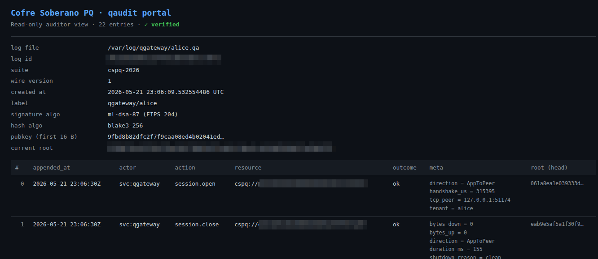

# Cofre Soberano PQ

*Versão em português do Brasil. O [README.md](README.md) em inglês é a referência normativa para termos de licença.*

> *Fronteira criptográfica pós-quântica para o Brasil regulado.*
>
> **Compress everything. Trust nothing. Encrypt always.**

Um monorepo para a linha de produtos **Cofre Soberano PQ (CSPQ)** — uma
fronteira criptográfica pós-quântica para setores regulados brasileiros
(bancos, seguradoras, saúde, governo). Consulte [`SPEC.md`](./SPEC.md) para a
especificação completa e o roadmap; este README foca no que já está disponível
hoje.



**Documentação voltada ao operador:**
- [`docs/RUNBOOK.md`](./docs/RUNBOOK.md) — implantação em produção, operações
  diárias, contrato de sinais, referência de métricas, resolução de problemas,
  resposta a incidentes
- [`docs/HSM.md`](./docs/HSM.md) — guia passo a passo de integração do
  assinador de auditoria com suporte a PKCS#11 / HSM
- [`docs/SMOKE_TEST.md`](./docs/SMOKE_TEST.md) — procedimento de validação de
  produção ponta a ponta (dois hosts, internet real, cadeia de auditoria
  verificada de forma cruzada)
- [`CHANGELOG.md`](./CHANGELOG.md) — histórico de releases

Se você está implantando o gateway em produção, leia o `RUNBOOK.md` primeiro.
Se você está avaliando o produto em condições reais de rede, comece pelo
`SMOKE_TEST.md`. O SPEC serve para entender o design.

| Componente | Crate            | Situação   | Descrição                                         |
|------------|------------------|------------|---------------------------------------------------|
| QAudit     | `qaudit-core`    | Sprint 2 ✅ | Biblioteca: registro de auditoria Merkle assinado PQ + exportação XML/JSONL |
| QAudit CLI | `qaudit`         | Sprint 2 ✅ | CLI para init / append / verify / inspect / export de registros `.qa` |
| QAudit HSM | `qaudit-hsm`     | Sprint 2 ✅ | Substrato do trait Signer — soft + PKCS#11 (Dinamo / YubiHSM / Thales / nShield) |
| QAudit Portal | `qaudit-portal`| Sprint 2 ✅ | Visualizador web somente-leitura em Axum para auditores |
| QTransport CSPQ | `qtransport-cspq` | Sprint 3 ✅ | Transporte PQ de referência: ML-KEM-1024 + ML-DSA-87 + ChaCha20-Poly1305 |
| QGateway Core | `qgateway-core` | Sprint 3 ✅ | Configuração, métricas, canal de auditoria, substrato de proxy bidirecional |
| QGateway   | `qgateway`       | Sprint 3 ✅ | Daemon de proxy reverso TCP↔CSPQ (serve-tcp / serve-pq) |
| QVault     | (planejado)      | Sprint 5   | Armazenamento de blobs codificado em Zupt compatível com S3 |

---

## O que é o QAudit

Uma ferramenta pequena e cuidadosa que produz um registro de auditoria
**verificável offline**, **somente-anexação (append-only)**, **encadeado por
Merkle** e **assinado de forma pós-quântica**.

- **Algoritmo:** assinaturas ML-DSA-87 (FIPS 204), Merkle Mountain Range em
  BLAKE3.
- **Formato de arquivo:** binário `.qa` único, codificado em CBOR, com prefixo
  mágico.
- **Modelo de confiança:** qualquer parte que possua a chave pública do
  registro pode verificar toda a cadeia sem contatar o emissor — sem rede, sem
  relógio, sem custódia de chaves (key escrow).
- **Conformidade:** projetado para atender ao LGPD Art. 46 ("estado da arte"),
  Bacen Res. 4.893, Bacen Circ. 3.978 (retenção PLD-FT), CVM Res. 80, ANPD
  GT-Cripto.

---

## Início rápido

```bash
# Build
cargo build --release --locked

# Initialize a new log + ML-DSA-87 keypair.
# In v1.0.1+, key files are named after the log: `audit.sk` and `audit.pk`,
# placed next to `audit.qa`. Pass `--sk PATH --pk PATH` to override.
./target/release/qaudit init --log audit.qa --label "qvault-prod-sp"

# Append events. In v1.0.1+, --sk and --pk default to <log-stem>.sk
# and <log-stem>.pk next to the log file; the example below relies on
# that. Pass --sk PATH --pk PATH if your keys live elsewhere.
./target/release/qaudit append \
    --log audit.qa \
    --actor "svc:qvault" --action "object.put" \
    --resource "vault://prod/customers/2026-05/file.pdf" \
    --meta size_bytes=182734 --meta tenant=itau

# Verify (anyone with the .pk file can do this; no .sk needed)
./target/release/qaudit verify --log audit.qa --pk audit.pk

# Inspect (human-readable)
./target/release/qaudit inspect --log audit.qa --limit 10

# Inspect (machine-readable, NDJSON)
./target/release/qaudit inspect --log audit.qa --json

# Export to Bacen / CVM / ANPD XML schema v1
./target/release/qaudit export --log audit.qa --format xml --out export.xml

# Export to newline-delimited JSON for log aggregators (Splunk, Elastic, Wazuh)
./target/release/qaudit export --log audit.qa --format jsonl --out export.jsonl

# Read-only web portal for auditors (binds 127.0.0.1 by default)
./target/release/qaudit-portal --log audit.qa --pk audit.pk --listen 127.0.0.1:8080
# then open http://127.0.0.1:8080/ — also exposes /api/info, /api/entries, /api/verify
```

---

## Assinatura por HSM (produção)

Chaves de software são exclusivas do modo de desenvolvimento. A partir do
Sprint 2, o `qaudit-hsm` fornece um `Pkcs11Signer` para qualquer driver
PKCS#11 v3 (Dinamo, YubiHSM 2, Thales Luna 7, Entrust nShield, SoftHSM 2).
Compile a feature opcional:

```bash
cargo build --release --locked -p qaudit-hsm --features pkcs11
```

O trait `Signer` em `qaudit_core` é o ponto de integração:

```rust
use qaudit_hsm::{Pkcs11Config, Pkcs11Signer};
use qaudit_core::AuditLog;

let cfg = Pkcs11Config::new("/opt/dinamo/lib/libdinamo.so", 0, "audit-prod-key")
    .with_pin(std::env::var("HSM_PIN")?)
    .with_mechanism_id(0x8000_0001); // vendor-specific ML-DSA OID
let signer = Pkcs11Signer::open(cfg)?;
let log = AuditLog::create_with_signer(signer, "qvault-prod-sp")?;
```

ML-DSA sobre PKCS#11 atualmente usa IDs de mecanismo definidos pelo fornecedor;
o padrão é `CKM_VENDOR_DEFINED + 0x0001` e pode ser sobrescrito por HSM.
Espera-se que o PKCS#11 v3.2 padronize `CKM_ML_DSA`; quando for lançado, o
padrão será atualizado.

---

## Verificando um registro de forma independente (cenário do auditor)

Um regulador recebe `audit.qa` e `qaudit.pk` do banco. Ele executa:

```bash
qaudit verify --log audit.qa --pk qaudit.pk
```

Código de saída `0` ⇒ toda assinatura é válida sob aquela chave, cada elo da
cadeia se mantém, nenhuma entrada foi inserida, excluída ou reordenada.
Qualquer adulteração em qualquer ponto do arquivo produz um código de saída
diferente de zero com um diagnóstico preciso. A mesma garantia se aplica ao
`qaudit export` (que por padrão se recusa a exportar um registro que falhe na
verificação pré-exportação).

---

## QGateway — sidecar de proxy reverso PQ (Sprint 4)

O QGateway tunela tráfego TCP arbitrário sobre o transporte pós-quântico CSPQ
(ML-KEM-1024 + ML-DSA-87 + ChaCha20-Poly1305). Dois gateways rodam em par: um
em modo `serve-tcp` (aceita o TCP da aplicação local, disca o peer sobre CSPQ)
e um em modo `serve-pq` (aceita CSPQ de entrada vindo do peer, disca a
aplicação de backend). Cada sessão emite eventos de auditoria assinados
`session.open` e `session.close` em ambos os lados; as métricas são expostas em
formato texto do Prometheus com labels por tenant.

**O Sprint 4 introduz:** roteamento multi-tenant (um gateway, N pares de peers
isolados), vínculo persistente de chave de auditoria (`.audit.skid`), assinador
de auditoria PKCS#11 opcional, terminação TLS 1.3 no lado de escuta do
serve-tcp e um protocolo de fechamento gracioso (marcador de EOF autenticado de
comprimento zero).

```bash
# 1. Generate transport identity keys (one pair per gateway host).
qgateway keygen --sk /etc/qgateway/qg.skid --pk /etc/qgateway/qg.cspqid.pub

# 2. Generate an audit signer (the key that signs every entry in the .qa logs).
#    Keep .audit.skid as 0600; the .audit.pub is the artifact you give regulators.
qgateway audit-keygen \
  --sk /etc/qgateway/audit.skid \
  --pk /etc/qgateway/audit.pub

# 3. Exchange transport public keys per tenant. Each tenant has its own
#    /etc/qgateway/peers-<tenant>/ allow-list, so trust scopes are isolated.
mkdir -p /etc/qgateway/peers-sp /etc/qgateway/peers-rj
scp host-sp:/etc/qgateway/qg.cspqid.pub /etc/qgateway/peers-sp/host-sp.cspqid.pub
scp host-rj:/etc/qgateway/qg.cspqid.pub /etc/qgateway/peers-rj/host-rj.cspqid.pub

# 4. Multi-tenant config (serve-tcp side, with TLS termination on one tenant):
cat > /etc/qgateway/sidecar.toml <<'EOF'
role           = "serve-tcp"
identity_key   = "/etc/qgateway/qg.skid"
identity_pub   = "/etc/qgateway/qg.cspqid.pub"
metrics_listen = "127.0.0.1:9099"

[audit_signer]
kind       = "softkey"
secret_key = "/etc/qgateway/audit.skid"
public_key = "/etc/qgateway/audit.pub"

[[tenants]]
name         = "branch-sp"
listen       = "127.0.0.1:8443"
peer_pq      = "10.0.1.50:9999"
peer_pub_dir = "/etc/qgateway/peers-sp"
audit_log    = "/var/lib/qgateway/sp.qa"

# TLS 1.3 termination — local apps speak TLS to qgateway,
# qgateway promotes the link to CSPQ across the WAN.
[tenants.tls]
cert = "/etc/qgateway/tls/sp-server.pem"
key  = "/etc/qgateway/tls/sp-server.key"

[[tenants]]
name         = "branch-rj"
listen       = "127.0.0.1:8444"
peer_pq      = "10.0.2.50:9999"
peer_pub_dir = "/etc/qgateway/peers-rj"
audit_log    = "/var/lib/qgateway/rj.qa"
# (no [tenants.tls] block → plain TCP listener)
EOF

# 5. On the peer (serve-pq) host:
cat > /etc/qgateway/sidecar.toml <<'EOF'
role           = "serve-pq"
identity_key   = "/etc/qgateway/qg.skid"
identity_pub   = "/etc/qgateway/qg.cspqid.pub"
metrics_listen = "127.0.0.1:9099"

[audit_signer]
kind       = "softkey"
secret_key = "/etc/qgateway/audit.skid"
public_key = "/etc/qgateway/audit.pub"

[[tenants]]
name         = "branch-sp"
listen       = "0.0.0.0:9999"
backend      = "127.0.0.1:80"
peer_pub_dir = "/etc/qgateway/peers-sp"
audit_log    = "/var/lib/qgateway/sp.qa"
EOF

# 6. (Optional) PKCS#11-bound audit signer instead of softkey.
#    Rebuild the daemon with the pkcs11 feature:
cargo build -p qgateway --features pkcs11 --release
#    Then in the TOML, replace [audit_signer]:
cat <<'EOF'
[audit_signer]
kind         = "pkcs11"
module       = "/opt/dinamo/lib/libdinamo.so"
slot         = 0
pin_env      = "QGATEWAY_HSM_PIN"          # PIN is read from this env var
key_label    = "qgateway-audit-prod"
mechanism_id = 0x80000001                  # vendor-defined ML-DSA-87 OID
EOF

# 7. Run both gateways (systemd unit recommended):
QGATEWAY_HSM_PIN='…' qgateway run --config /etc/qgateway/sidecar.toml

# 8. Inspect operational state:
curl http://127.0.0.1:9099/healthz
curl http://127.0.0.1:9099/metrics | grep qgateway_
# Note: every metric now has a tenant="branch-sp" / tenant="branch-rj" label.

# 9. Verify audit logs per tenant:
qaudit verify  --log /var/lib/qgateway/sp.qa --pk /etc/qgateway/audit.pub
qaudit inspect --log /var/lib/qgateway/rj.qa --limit 20
```

Reiniciar o daemon preserva a cadeia de auditoria: desde que a mesma
`.audit.skid` esteja configurada, o registro é reaberto e novas entradas
estendem a cadeia assinada. O daemon se recusa a estender um registro cuja
chave pública de cabeçalho não corresponda ao assinador de auditoria
configurado (o que detecta erros do operador, como trocar chaves de auditoria
sem rotacionar o arquivo de registro).

### Chaves de auditoria por tenant (Sprint 5)

O bloco de nível superior `[audit_signer]` é um **padrão**, não uma obrigação.
Qualquer tenant pode sobrescrevê-lo com `[tenants.audit_signer]`:

```toml
[audit_signer]                     # daemon-level fallback
kind       = "softkey"
secret_key = "/etc/qgateway/audit-default.skid"
public_key = "/etc/qgateway/audit-default.pub"

[[tenants]]
name      = "regulated"
listen    = "127.0.0.1:8443"
peer_pq   = "10.0.1.50:9999"
peer_pub_dir = "/etc/qgateway/peers-regulated"
audit_log = "/var/lib/qgateway/regulated.qa"

# This tenant uses its OWN audit key in an HSM, not the default.
[tenants.audit_signer]
kind         = "pkcs11"
module       = "/opt/dinamo/lib/libdinamo.so"
slot         = 0
pin_env      = "QGATEWAY_HSM_PIN_REGULATED"
key_label    = "audit-regulated-prod"
mechanism_id = 0x80000001

[[tenants]]
name      = "internal"
listen    = "127.0.0.1:8444"
peer_pq   = "10.0.2.50:9999"
peer_pub_dir = "/etc/qgateway/peers-internal"
audit_log = "/var/lib/qgateway/internal.qa"
# (inherits the daemon-level default)
```

A postura mais forte é omitir completamente o `[audit_signer]` de nível
superior e exigir que cada tenant declare o seu próprio. Sem fallback, a
herança acidental se torna impossível:

```toml
# No top-level [audit_signer] — every tenant MUST declare one.

[[tenants]]
name      = "sp"
# ...
[tenants.audit_signer]
kind = "softkey"
secret_key = "/etc/qgateway/audit-sp.skid"
public_key = "/etc/qgateway/audit-sp.pub"

[[tenants]]
name      = "rj"
# ...
[tenants.audit_signer]
kind = "softkey"
secret_key = "/etc/qgateway/audit-rj.skid"
public_key = "/etc/qgateway/audit-rj.pub"
```

O comprometimento da chave de auditoria de um tenant (seja o arquivo
`.audit.skid` ou o slot de HSM) não permite que um atacante forje entradas no
registro de outro tenant. Para reguladores que auditam um único tenant,
entregue apenas o `.audit.pub` daquele tenant — eles podem verificar a cadeia
completa sem nunca ver os dados de nenhum outro tenant.

### Hot-reload de certificados (Sprint 5.5)

Rotações de certificados (Let's Encrypt a cada 90 dias, CA corporativa em
cadência anual, certificados de curta duração ACME a cada hora) não exigem
reinício do gateway. Depois que sua ferramenta de renovação substituir
atomicamente os arquivos de certificado + chave, envie SIGUSR1 ao daemon:

```bash
$ certbot renew   # or your equivalent renewal workflow
$ kill -USR1 $(pidof qgateway)
```

O daemon percorre cada tenant com TLS habilitado, relê o certificado + chave de
`[tenants.tls]` do disco, constrói um `TlsAcceptor` novo e o instala
atomicamente. Handshakes em andamento terminam no acceptor anterior (sem troca
no meio do handshake, o que corromperia o estado). O *próximo* accept em cada
tenant assume o novo certificado.

Se um reload falhar (erro de digitação no caminho, PEM inválido, escrita
parcial durante rename atômico), o daemon registra `TLS reload FAILED, keeping
previous cert: …` e continua servindo com o certificado antigo. Corrija a causa
subjacente e reenvie SIGUSR1; não há interrupção de tráfego de qualquer forma.

### Roteamento de tenants por SNI (Sprint 6)

Vários tenants podem compartilhar uma única porta de escuta TLS e ser
despachados pelo hostname SNI no momento do handshake. Cada tenant declara seu
próprio SNI e seu próprio certificado; o gateway constrói um `TlsAcceptor`
compartilhado com um resolvedor de certificados multi-SNI. Isolamento estrito —
SNIs desconhecidos recebem um alerta TLS `unrecognized_name` sem certificado de
fallback.

```toml
[audit_signer]
kind = "softkey"
secret_key = "/etc/qgateway/audit.skid"
public_key = "/etc/qgateway/audit.pub"

# Both tenants share 0.0.0.0:8443 — implicit SNI group.

[[tenants]]
name      = "sp"
listen    = "0.0.0.0:8443"
sni       = "sp.example.com"
peer_pq   = "10.0.1.50:9999"
peer_pub_dir = "/etc/qgateway/peers-sp"
audit_log = "/var/lib/qgateway/sp.qa"
[tenants.tls]
cert = "/etc/qgateway/tls/sp.pem"
key  = "/etc/qgateway/tls/sp.key"

[[tenants]]
name      = "rj"
listen    = "0.0.0.0:8443"
sni       = "rj.example.com"
peer_pq   = "10.0.2.50:9999"
peer_pub_dir = "/etc/qgateway/peers-rj"
audit_log = "/var/lib/qgateway/rj.qa"
[tenants.tls]
cert = "/etc/qgateway/tls/rj.pem"
key  = "/etc/qgateway/tls/rj.key"
```

Regras de validação aplicadas no momento do carregamento da configuração:

- Tenants que compartilham um `listen` DEVEM todos declarar hostnames `sni`
  distintos E todos DEVEM ter `[tenants.tls]` definido.
- Um listener de tenant único (sem irmãos) NÃO DEVE ter `sni` definido — é um
  campo inútil e a falsa sensação de isolamento de roteamento é um sintoma de
  configuração ruim (config smell).
- Hostnames SNI duplicados dentro de um grupo → erro.
- Membros com TLS ligado / TLS desligado misturados em um grupo → erro.

**SNI curinga** (Sprint 8): um tenant pode declarar `sni = "*.host.example.com"`
para casar com todo subdomínio de rótulo único (`api.host.example.com`,
`www.host.example.com`, …), mas não de múltiplos rótulos (`x.y.host.example.com`)
nem o sufixo puro (`host.example.com`). O formato do padrão é estrito —
apenas `*.` como rótulo mais à esquerda é aceito; asteriscos no meio da string
(`a.*.com`) e curingas sem ponto (`*foo`) são rejeitados no carregamento da
configuração. Correspondências SNI exatas sempre vencem os curingas, então você
pode declarar tanto `priority.example.com` (exato) quanto `*.example.com`
(catchall) no mesmo listener e o resolvedor roteará corretamente.

O mesmo override por tenant `[tenants.audit_signer]` (Sprint 5) e o hot-reload
(Sprint 5.5 para TLS de tenant único, Sprint 6.5 para grupos SNI — o SIGUSR1
reconstrói atomicamente todo o resolvedor multi-SNI) continuam funcionando
junto com o agrupamento SNI.

Handshake p50 em hardware comum: ~3 ms.

---

## Cadeia de rotação de registros de auditoria (Sprint 7)

Um gateway de longa duração pode rotacionar seu registro de auditoria `.qa`
sem quebrar a integridade criptográfica da cadeia. Cada arquivo rotacionado
carrega:

- Um `prev_log_id` em seu cabeçalho referenciando o id de registro do
  predecessor.
- Um `prev_log_final_root` em seu cabeçalho — a raiz MMR do predecessor
  *após* seu evento final `audit.rotation_close`. Este é o elo criptográfico
  que torna detectável a exclusão silenciosa de registros intermediários.
- Um evento `audit.rotation_open` como sua PRIMEIRA entrada, reafirmando as
  referências ao predecessor nos metadados. Assinado sob a chave do novo
  registro.

O ÚLTIMO evento do predecessor é `audit.rotation_close` com metadados apontando
para frente, para o id do novo registro. Assinado sob a chave do registro
antigo.

```rust
// Programmatic rotation:
let (sealed_old, new_open) = old_log.rotate_to(
    new_signer,                    // Box<dyn Signer>; can be same or different key
    "audit-2026-02",               // human-readable label for the new log
    "",                            // empty → random new log id (or pass hex to pin)
)?;
sealed_old.save_to("audit-2026-01.qa")?;
// new_open is open for appending. Save it on shutdown.
```

Verificando uma cadeia de múltiplos arquivos:

```rust
// A regulator has the audit pubkey(s) and the chain on disk.
let a = AuditLog::open("audit-2026-01.qa")?;
let b = AuditLog::open("audit-2026-02.qa")?;
let c = AuditLog::open("audit-2026-03.qa")?;
AuditLog::verify_chain(&[&a, &b, &c])?;   // walks all 6 integrity properties
```

O `verify_chain` impõe:

1. A cadeia de assinaturas interna de cada registro é válida (`verify` por
   registro).
2. O primeiro registro da fatia não tem `prev_log_id` (proteção contra erro
   do operador ao passar registros fora de ordem).
3. O último evento do predecessor é `audit.rotation_close` com
   `metadata.new_log_id` correspondendo ao id real do próximo registro.
4. O `header.prev_log_id` do próximo registro corresponde ao id do
   predecessor.
5. O `header.prev_log_final_root` do próximo registro corresponde à raiz MMR
   real computada do predecessor (após o rotation_close).
6. O primeiro evento do próximo registro é `audit.rotation_open` com metadados
   consistentes.

As falhas identificam o id de registro específico e a propriedade específica
que quebrou. **A rotação com troca de chave é suportada** — rotacionar a chave
de auditoria no mesmo momento da rotação de arquivo é uma única operação
coerente; cada segmento de registro é verificado sob sua própria chave pública
de cabeçalho.

---

## CLI de rotação de auditoria (Sprint 7.5)

A CLI `qaudit` traz dois subcomandos para operações de rotação offline:

```bash
# Offline rotation: seal current log, create successor.
qaudit rotate \
    --in     audit-current.qa \
    --out    audit-2026-02.qa \
    --sk     audit.skid \
    --pk     audit.pub \
    --new-label "audit-2026-02"

# Multi-file chain verification (regulator workflow):
qaudit verify-chain \
    --log audit-2025-12.qa \
    --log audit-2026-01.qa \
    --log audit-2026-02.qa \
    --pk  audit.pub
```

O `qaudit rotate` modifica o arquivo de entrada no local (anexando o sentinela
`rotation_close`) e cria o arquivo de saída com `rotation_open` como seu
primeiro evento. A mesma chave de auditoria assina ambos os eventos — para
rotação com troca de chave, use diretamente a API da biblioteca.

O `qaudit verify-chain` percorre cada par adjacente, impondo as seis
propriedades de integridade do Sprint 7. Omita `--pk` para verificar uma
cadeia com troca de chave (cada segmento verificado sob sua própria chave
pública de cabeçalho); passe `--pk` para exigir uma única chave em toda a
cadeia.

Até que o Sprint 7.6 conecte a rotação automática ao daemon, os operadores
podem agendar a rotação via cron:

```cron
# Monthly at 02:00 on the first day:
0 2 1 * * /usr/local/bin/qaudit rotate \
    --in /var/lib/qg/sp-current.qa \
    --out /var/lib/qg/archive/sp-$(date +%%Y-%%m).qa \
    --sk /etc/qg/audit.skid --pk /etc/qg/audit.pub \
    --new-label "sp-$(date +%%Y-%%m)" \
    && systemctl restart qgateway
```

A janela de indisponibilidade no reinício costuma ser inferior a um segundo
sob systemd; para cadências típicas de rotação mensal isso é operacionalmente
aceitável.

---

## Rotação automática no daemon (Sprint 8 / 8.5)

O Sprint 8 adicionou um schema de configuração `RotationPolicy`, uma API
`AuditChannel::rotate()` e um handler de sinal SIGUSR2 que distribui
solicitações de rotação por todos os tenants cujo assinador de auditoria as
suporte (Softkey hoje; PKCS#11 no Sprint 9). O Sprint 8.5 fechou a lacuna de
rotação automática com uma tarefa de monitor em segundo plano por tenant que
dispara `request_rotation_silent` quando os limiares configurados são
ultrapassados.

```toml
# /etc/qgateway/sidecar.toml
[rotation]
max_entries     = 100_000     # rotate after 100k events
max_bytes       = 134_217_728 # OR after segment exceeds 128 MiB
max_age_secs    = 86_400      # OR after 24h
archive_pattern = "{label}-{ts}-{counter}.qa"
```

Qualquer um entre `max_entries`, `max_bytes` ou `max_age_secs` é suficiente
para habilitar o monitor — o primeiro a ser ultrapassado vence. O monitor faz
polling a cada 5s. `{label}` é o nome do tenant, `{ts}` é `YYYYMMDDTHHMMSSZ`,
`{counter}` é um inteiro monotônico por tenant começando em 1. Tanto o SIGUSR2
quanto o monitor compartilham o mesmo contador, de modo que a sequência de
arquivamento é contígua independentemente de qual caminho disparou.

O `max_bytes` é best-effort (salvamentos em lote significam que o arquivo pode
ultrapassar brevemente o limiar por até um lote de eventos). Para limites
rígidos, prefira `max_entries` (exato) ou `max_age_secs` (monotônico com o
relógio de parede). A métrica `qgateway_audit_rotations_total` acompanha as
rotações bem-sucedidas por tenant; rotações que falham são registradas em
nível de erro e mantêm o registro anterior aberto.

O SIGUSR2 continua funcionando junto com o monitor:

```bash
$ kill -USR2 $(pidof qgateway)
[INFO  qgateway] SIGUSR2 received, rotating audit logs (n_tenants=2)
[INFO  qgateway] audit rotation requested tenant=sp archive=/var/lib/qg/sp-20260520T010843Z-1.qa
[INFO  qgateway] audit rotation requested tenant=rj archive=/var/lib/qg/rj-20260520T010843Z-1.qa
```

---

## Rotação em HSM + rotação com troca de chave (Sprint 9)

Assinadores de auditoria baseados em PKCS#11 agora rotacionam da mesma forma
que os assinadores Softkey. A nova `Pkcs11SignerFactory` abre uma nova sessão
de HSM por rotação (tipicamente <100ms em Dinamo local; mais em HSMs em rede).
Zero downtime, zero troca de chave — apenas o arquivo é rotacionado.

Para resposta a incidentes — quando se suspeita que uma chave de auditoria foi
comprometida — o `qaudit rotate` aceita `--new-sk` e `--new-pk` para rotação
com troca de chave:

```bash
qaudit rotate \
    --in   /var/lib/qg/audit-current.qa \
    --out  /var/lib/qg/audit-2026-q2.qa \
    --sk   /etc/qg/audit-2026-q1.skid \
    --pk   /etc/qg/audit-2026-q1.pub \
    --new-sk /etc/qg/audit-2026-q2.skid \
    --new-pk /etc/qg/audit-2026-q2.pub \
    --new-label "audit-2026-q2"
```

O sentinela `rotation_close` é assinado sob a chave ANTIGA. O `rotation_open`
do novo registro + todo evento subsequente é assinado sob a chave NOVA. O
`verify_chain` valida cada segmento sob sua própria chave pública de cabeçalho
— NÃO passe `--pk` ao verificar uma cadeia com troca de chave.

A rotação com troca de chave é intencionalmente exclusiva da CLI (sem SIGUSR2 /
sem disparo por monitor). É uma ação offline do operador; disparar
automaticamente uma troca de chave anularia a perícia forense da trilha de
auditoria que ela existe para viabilizar.

---

## Controle de admissão de conexões (Sprint 9.5)

Cota por tenant + limite de taxa por IP de origem com token-bucket, configurado
em TOML, avaliado no caminho quente de accept ANTES dos handshakes. Ambos são
opt-in — tenants sem blocos `[limits]` não veem nenhuma mudança de
comportamento.

```toml
[[tenants]]
name = "sp"
listen = "0.0.0.0:8443"
sni = "sp.bank.example.com"
# ... other tenant fields ...

[tenants.limits]
max_concurrent = 500       # at most 500 in-flight sessions for this tenant

[tenants.limits.rate_limit_per_source]
capacity        = 20       # burst of 20 conns from one source IP
refill_per_sec  = 5        # then 5 conns/sec sustained
```

Conexões rejeitadas são descartadas com TCP RST. Nenhum custo de handshake é
pago em conexões rejeitadas para listeners de tenant único. Grupos SNI pagam o
custo do handshake TLS antes de saber a quais limites de tenant se aplicam
(limitação documentada; para proteção rígida pré-handshake em portas
compartilhadas, implante um limitador de camada 4 a montante).

Observabilidade:

```text
qgateway_admission_rejected_quota_total{tenant="sp"} 47
qgateway_admission_rejected_rate_total{tenant="sp"}  213
```

A saturação da cota sugere escalar horizontalmente ou aumentar
`max_concurrent`; rejeições de taxa sustentadas sugerem abuso — cruze com os
logs de acesso para identificar o IP de origem. Os buckets são por tenant e por
origem — tenants diferentes não compartilham estado.

O Sprint 10.5 adiciona uma varredura de GC preguiçosa: quando o mapa de buckets
por origem de um tenant cresce além de 8192 entradas, cada accept avalia o mapa
e descarta as entradas que estão (a) reabastecidas até a capacidade E (b)
ociosas por mais de 5 minutos. A memória permanece limitada a
`8192 + 300 * arrival_rate` entradas; para 1k origens/min sustentadas, o regime
estacionário é de ~13k entradas (~650 KiB), independentemente das conexões
cumulativas.

---

## Observabilidade de HSM (Sprint 10)

Assinadores de auditoria PKCS#11 agora reportam o ciclo de vida da sessão e
eventos de assinatura como contadores Prometheus. Os operadores veem falhas de
HSM dentro do próximo intervalo de scrape em vez de acompanhar os logs de
tracing.

```text
qgateway_hsm_sessions_opened_total{tenant="sp"} 4
qgateway_hsm_sessions_failed_total{tenant="sp"} 0
qgateway_hsm_sign_ops_total{tenant="sp"}        18742
qgateway_hsm_sign_failures_total{tenant="sp"}   0
```

Alertas sugeridos:

```yaml
- alert: QGatewayHsmSessionsFailing
  expr: rate(qgateway_hsm_sessions_failed_total[5m]) > 0
  for: 1m
- alert: QGatewayHsmSignFailing
  expr: |
    rate(qgateway_hsm_sign_failures_total[5m]) > 0
    and on (tenant) rate(qgateway_hsm_sessions_opened_total[5m]) == 0
  for: 30s
```

Falhas de assinatura sem falhas concorrentes de abertura de sessão indicam que
a sessão ativa está rejeitando assinaturas (token desconectado no meio da
sessão, mecanismo não suportado após atualização de firmware). Falhas de
abertura de sessão indicam uma interrupção mais ampla (PIN expirado, slot
inacessível, problema de driver).

Implantações Softkey deixam esses contadores em 0 — eles só se movem quando um
assinador PKCS#11 está configurado.

---

## Ciclo de vida de tenants em tempo de execução via SIGHUP (Sprints 11.0 → 13)

Os operadores adicionam novos tenants e detectam mudanças de configuração no
daemon em execução sem um reinício completo.

```bash
$ cat >> /etc/qgateway/sidecar.toml <<EOF

[[tenants]]
name         = "branch-bahia"
listen       = "0.0.0.0:8447"
peer_pq      = "10.0.5.10:9999"
peer_pub_dir = "/etc/qg/peers-bahia"
audit_log    = "/var/lib/qg/bahia.qa"
EOF

$ kill -HUP $(pidof qgateway)

[INFO  qgateway] SIGHUP received config="/etc/qgateway/sidecar.toml"
[INFO  qgateway] config reload diff
                added=1 removed=0 unchanged=3 config_changed=0
[INFO  qgateway] tenant="branch-bahia" role=ServeTcp
                "tenant ADDED at runtime — serving traffic"
```

Quando um operador edita as configurações de um tenant existente, o SIGHUP
reporta os campos específicos que mudaram, classificados como **Hot**
(aplicados sem reinício) ou **Cold** (exigem reinício):

```bash
# Operator raises branch-sp's limits.max_concurrent from 100 to 200.
$ kill -HUP $(pidof qgateway)
[INFO  qgateway] tenant="branch-sp" fields=["limits"] kind="hot"
                "tenant limits hot-applied (new policy in effect for future
                 connections; in-flight permits unaffected)"
[INFO  qgateway] config reload diff
                added=0 removed=0 unchanged=4
                config_changed_hot=1 config_changed_cold=0
```

A aplicação a quente (Sprint 16) troca atomicamente o `AdmissionController` do
tenant sem reiniciar o loop de accept. Os permits em andamento do controlador
ANTIGO permanecem válidos — as sessões existentes concluem naturalmente — e as
NOVAS conexões contam contra a nova política. Os buckets de limite de taxa por
origem são zerados na troca (uma escolha deliberada: um operador que aperta os
limites de taxa como mitigação de abuso NÃO deve usar uma edição de limites —
isso é uma operação de remoção de tenant, Sprint 17+).

Mudanças cold ainda exigem reinício e são reportadas separadamente:

```bash
[WARN  qgateway] tenant="branch-sp" fields=["listen"] kind="cold"
                "tenant configuration changed (cold-only, restart required)"
```

A separação permite que os operadores façam a triagem:

- Apenas hot → política aplicada automaticamente; nenhuma ação necessária
- Qualquer cold → é preciso reiniciar agora ou reverter a edição

O Sprint 17 adiciona contadores Prometheus para o caminho de SIGHUP, de modo
que essa triagem possa ser automatizada:

```text
qgateway_sighup_cycles_total                 # successful SIGHUP cycles
qgateway_sighup_failed_total                 # validation failures
qgateway_tenants_added_total                 # runtime ADDs
qgateway_tenants_add_failed_total            # ADD failures
qgateway_tenants_removed_total               # runtime REMOVEs (Sprint 18)
qgateway_tenants_remove_failed_total         # REMOVE drain timeouts (Sprint 18)
qgateway_limits_hot_applied_total            # hot-applied limits edits
qgateway_config_changed_hot_total            # diff entries (Hot)
qgateway_config_changed_cold_total           # diff entries (Cold)
```

Alerte com base em `rate(qgateway_sighup_failed_total[15m])` para TOML inválido
em produção; alerte com base em `increase(qgateway_config_changed_cold_total[1h])`
para desvio de configuração (mudanças cold se acumulando sem reinício).

### Remoção de tenant em tempo de execução (Sprint 18)

Tenants únicos serve-tcp simples e todos os tenants serve-pq podem ser
removidos sem reiniciar o daemon. Edite o TOML para remover o bloco
`[[tenants]]` e envie SIGHUP:

```bash
$ kill -HUP $(pidof qgateway)
[INFO  qgateway] tenant="branch-bahia" "tenant drained and removed"
[INFO  qgateway] config reload apply summary
                added_applied=0 added_failed=0
                removed_applied=1 removed_failed=0
```

O protocolo de drain notifica apenas o loop de accept do tenant-alvo; as
sessões em andamento de OUTROS tenants não são afetadas. O timeout padrão de
drain é 30s — sessões que não honram o cancelamento nessa janela disparam um
incremento de `tenants_remove_failed_total` e deixam a entrada nos mapas
compartilhados (reinício do daemon necessário para limpeza completa).

O Sprint 19 torna o timeout de drain configurável pelo operador via TOML:

```toml
# Top-level config (sidecar.toml)
tenant_drain_timeout_secs = 60   # default 30
```

O Sprint 19 também adiciona um drain gracioso do canal de auditoria. Depois que
o loop de accept termina, o daemon chama `AuditChannel::shutdown_async()` no
canal de auditoria do tenant ANTES de removê-lo do mapa compartilhado. A tarefa
de escrita descarrega seu buffer em memória para o disco e termina de forma
limpa:

```bash
[INFO  qgateway] tenant="branch-bahia"
                "tenant drained and removed (audit channel flushed)"
```

O Sprint 18 deixou a limpeza do canal de auditoria como best-effort (baseada em
Drop); o Sprint 19 fecha essa lacuna.

### Tenants com TLS habilitado em tempo de execução (Sprint 20)

O Sprint 20 fecha a última lacuna do ciclo de vida por tenant: tenants únicos
com TLS habilitado agora podem ser ADICIONADOS e REMOVIDOS em tempo de execução
via SIGHUP, assim como os tenants TCP simples e serve-pq. A restrição anterior
do Sprint 18 ("tenants únicos com TLS habilitado NÃO são individualmente
removíveis") acabou.

Adicionando um tenant com TLS habilitado:

```toml
# /etc/qgateway/sidecar.toml
[[tenants]]
name = "branch-new"
listen = "127.0.0.1:9445"
peer_pq = "peer.example.com:9000"
peer_pub_dir = "/etc/qgateway/peers"
audit_log = "/var/log/qgateway/branch-new.qa"

[tenants.tls]
cert = "/etc/qgateway/certs/branch-new.crt"
key = "/etc/qgateway/keys/branch-new.key"
```

```bash
$ kill -HUP $(pidof qgateway)
[INFO  qgateway] tenant="branch-new" "TLS termination + hot-reload enabled (runtime add)"
[INFO  qgateway] tenant="branch-new" "tenant ADDED at runtime — serving traffic"

# The new tenant's cert is now in the SIGUSR1 reload set:
$ kill -USR1 $(pidof qgateway)
[INFO  qgateway] tenant="branch-new" "TLS cert reloaded"
```

Removendo um tenant com TLS habilitado:

```bash
$ kill -HUP $(pidof qgateway)
[INFO  qgateway] tenant="branch-new" "tenant drained and removed (audit channel flushed)"
[INFO  qgateway] tenant="branch-new" "TLS reload trigger purged"
```

**Ciclo de vida acumulado em tempo de execução (Sprint 20)**:

| Tipo de tenant | ADD | Reconfigurar limits a quente | REMOVE | Reload de certificado TLS |
|---|---|---|---|---|
| serve-pq | ✅ | ✅ | ✅ | N/A |
| serve-tcp (TCP simples) | ✅ | ✅ | ✅ | N/A |
| serve-tcp (TLS único) | ✅ | ✅ | ✅ | ✅ (SIGUSR1) |
| serve-tcp (grupo SNI) | ❌ reinício | ✅ | ❌ reinício | ✅ (SIGUSR1) |

Apenas ADD/REMOVE de grupo SNI multi-tenant ainda exige reinício do daemon
(listener compartilhado, tabela de dispatch mutável — trabalho do Sprint 21+).

### Infraestrutura de hot-swap de dispatch SNI (Sprint 21–22)

O Sprint 21 adicionou `HotSniDispatchTable` — um wrapper baseado em `arc_swap`
em torno de `SniDispatchTable` com métodos de builder imutável
`with_tenant_added` e `with_tenant_removed`.

O Sprint 22 conectou tudo:

- `run_sni_group` agora aceita `Arc<HotSniDispatchTable>`. A tarefa por sessão
  executa `dispatch.load().lookup(&sni)` exatamente uma vez logo após o
  handshake TLS. Trocas de dispatch concorrentes são invisíveis às sessões em
  andamento (semântica de guard do Arc).
- O `TlsReloadTrigger` para grupos multi-SNI agora expõe
  `add_sni_entry(label, sni, cfg)`, `remove_sni_entry(label)` e `sni_labels()`.
  Cada mutação reconstrói o acceptor multi-SNI do rustls e o troca atomicamente
  pelo canal de watch existente. O rollback em caso de falha de reconstrução
  mantém o estado do trigger consistente com o que está de fato servindo.

A conexão do braço de SIGHUP — usando essas duas APIs para adicionar/remover
tenants SNI de grupos em execução sem reiniciar o daemon — chegou no Sprint 23.
Veja abaixo.

### Tenants SNI em tempo de execução (Sprint 23)

O Sprint 23 compõe a infraestrutura dos Sprints 21 + 22 em um comportamento
visível ao operador: o SIGHUP agora pode adicionar um tenant a um grupo SNI em
execução, ou remover um, sem reiniciar o daemon.

Adicionando um tenant SNI a um grupo em execução:

```toml
# /etc/qgateway/sidecar.toml — operator adds carol to an SNI group
# already serving alice + bob on 127.0.0.1:9000:
[[tenants]]
name = "carol"
listen = "127.0.0.1:9000"          # same listen as alice/bob
peer_pq = "peer.example.com:9001"
peer_pub_dir = "/etc/qgateway/peers"
audit_log = "/var/log/qgateway/carol.qa"
sni = "carol.example.com"

[tenants.tls]
cert = "/etc/qgateway/certs/carol.crt"
key = "/etc/qgateway/keys/carol.key"
```

```bash
$ kill -HUP $(pidof qgateway)
[INFO  qgateway] tenant="carol" listen=127.0.0.1:9000 sni=carol.example.com
                "SNI tenant added at runtime — joining existing group"
```

Removendo um tenant SNI de um grupo:

```bash
$ kill -HUP $(pidof qgateway)
[INFO  qgateway] tenant="carol" listen=127.0.0.1:9000
                "SNI tenant removed at runtime (in-flight sessions continue under old context until natural end)"
```

REMOVE é soft-drain: novos handshakes TLS para o SNI removido falham
imediatamente (o certificado não está mais no resolvedor, o dispatch não mapeia
mais o hostname), mas as sessões em andamento que já resolveram seu contexto
continuam sob a identidade daquele tenant até terminarem naturalmente. O drain
rígido via `Arc<Notify>` por tenant SNI é trabalho do Sprint 24+.

**Ciclo de vida acumulado em tempo de execução (Sprint 23)**:

| Tipo de tenant | ADD | Reconfigurar limits a quente | REMOVE | Reload de certificado TLS |
|---|---|---|---|---|
| serve-pq | ✅ | ✅ | ✅ | N/A |
| serve-tcp (TCP simples) | ✅ | ✅ | ✅ | N/A |
| serve-tcp (TLS único) | ✅ | ✅ | ✅ | ✅ (SIGUSR1) |
| serve-tcp (SNI em grupo existente) | ✅ | ✅ | ✅ | ✅ (SIGUSR1) |
| Novo grupo SNI (primeiro tenant em novo listen) | ❌ reinício | N/A | N/A | N/A |

### Ciclo de vida de grupos SNI em tempo de execução (Sprint 24)

O Sprint 24 fecha a lacuna final do ciclo de vida. O daemon agora pode criar um
novo grupo SNI em um endereço de escuta antes não utilizado, e drenar um grupo
quando seu último tenant sai — ambos via SIGHUP, sem reinício.

Adicionando o primeiro tenant em um listen SNI totalmente novo:

```toml
# Operator adds an SNI tenant on a listen no other tenant uses:
[[tenants]]
name = "branch-east"
listen = "127.0.0.1:9100"
peer_pq = "peer.example.com:9101"
peer_pub_dir = "/etc/qgateway/peers"
audit_log = "/var/log/qgateway/branch-east.qa"
sni = "branch-east.example.com"

[tenants.tls]
cert = "/etc/qgateway/certs/branch-east.crt"
key = "/etc/qgateway/keys/branch-east.key"
```

```bash
$ kill -HUP $(pidof qgateway)
[INFO  qgateway] tenant="branch-east" "SNI tenant added at runtime — new group spawned"
[INFO  qgateway] listen=127.0.0.1:9100 n_tenants=1
                "SNI multi-tenant listener active (hot-swappable dispatch)"
```

Removendo o último tenant de um grupo:

```bash
$ kill -HUP $(pidof qgateway)
[INFO  qgateway] tenant="branch-east" "SNI tenant removed at runtime ..."
[INFO  qgateway] listen=127.0.0.1:9100 "SNI group empty after remove — draining"
[INFO  qgateway] listen=127.0.0.1:9100 "SNI group drained cleanly"
[INFO  qgateway] listen=127.0.0.1:9100 "SNI group purged from shared state"
# Port 9100 is now free.
```

**Ciclo de vida acumulado em tempo de execução (Sprint 24 — 100% verde)**:

| Tipo de tenant | ADD | Reconfigurar limits a quente | REMOVE | Reload de certificado TLS |
|---|---|---|---|---|
| serve-pq | ✅ | ✅ | ✅ | N/A |
| serve-tcp (TCP simples) | ✅ | ✅ | ✅ | N/A |
| serve-tcp (TLS único) | ✅ | ✅ | ✅ | ✅ (SIGUSR1) |
| serve-tcp (SNI em grupo existente) | ✅ | ✅ | ✅ | ✅ (SIGUSR1) |
| **Novo grupo SNI (primeiro tenant em novo listen)** | **✅ Sprint 24** | N/A | **✅ Sprint 24** | ✅ (SIGUSR1) |

O daemon suporta ADD / reconfiguração a quente / REMOVE / reload de certificado
com zero downtime para todo tipo de tenant. Nenhum reinício é necessário para
qualquer evento de ciclo de vida por tenant ou por grupo, exceto uma
atualização de binário.

### Teste de integração ponta a ponta (Sprint 25)

O Sprint 25 entrega o primeiro teste de integração que conduz um subprocesso
qgateway real por um ciclo de vida completo de SIGHUP:

```bash
$ cargo test -p qgateway --test sighup_integration
running 1 test
test sighup_add_then_remove_tenant_increments_counters ... ok

test result: ok. 1 passed; 0 failed; finished in 4.61s
```

O teste:
1. Cria o binário qgateway com uma configuração de 1 tenant.
2. Aguarda o `/metrics` subir.
3. Modifica a configuração para adicionar um segundo tenant, envia SIGHUP,
   verifica que `qgateway_tenants_added_total` foi incrementado.
4. Modifica a configuração de volta para remover o tenant adicionado, envia
   SIGHUP, verifica que `qgateway_tenants_removed_total` foi incrementado.
5. SIGTERM, verifica o encerramento limpo via guard de Drop.

O escopo do Sprint 25 é deliberadamente um tipo de tenant (`serve-pq`); o
harness de teste generaliza para os cenários de TLS único, SNI em grupo
existente e novo grupo SNI — adicioná-los é trabalho mecânico em sprints
subsequentes. Veja o SPEC §13.33 para detalhes.

### Integridade da cadeia de auditoria através de ciclos de SIGHUP (Sprint 26)

O Sprint 26 adiciona um segundo teste de integração que prova o invariante de
conformidade: todo arquivo de registro de auditoria por tenant é uma cadeia
assinada válida depois que o tenant passa por eventos do ciclo de vida de
SIGHUP.

```bash
$ cargo test -p qgateway --test audit_chain_integrity
running 2 tests
test audit_chains_remain_valid_across_sighup_cycle ... ok
test audit_chains_verify_against_provided_pubkey ... ok

test result: ok. 2 passed; 0 failed; finished in 9.93s
```

Os testes provam:
1. Os registros de auditoria do tenant fazem parse + verificam em todo evento
   do ciclo de vida (inicialização, no meio de um ciclo de SIGHUP, após REMOVE,
   após SIGTERM).
2. Um tenant adicionado em tempo de execução (via SIGHUP ADD) cria uma cadeia
   cujo cabeçalho carrega a chave pública correta do assinador.
3. Um tenant removido em tempo de execução (via SIGHUP REMOVE) tem o
   `shutdown_async` de seu canal de auditoria descarregado de forma limpa — o
   arquivo resultante ainda faz parse + verifica depois que o tenant se foi.
4. A verificação externa (carregando o `.audit.pub` publicado do disco
   separadamente) produz chaves públicas idênticas bit a bit — o caminho que um
   auditor de conformidade tomaria.

Este é o primeiro teste que exercita **a metade de escrita de auditoria do
daemon ponta a ponta dentro do loop ativo dirigido por sinais**. Todos os
testes de auditoria anteriores (48 em qaudit-core) cobrem o maquinário da
cadeia isoladamente; este o cobre em condições de produção.

### Interação entre rotação de auditoria e SIGHUP (Sprint 27)

O Sprint 27 adicionou dois testes de integração para a interação
SIGUSR2 ↔ SIGHUP. Escrever os testes revelou um bug real: o `rotation_targets`
do daemon era um `Vec` populado na inicialização que nunca crescia no
SIGHUP ADD, de modo que qualquer tenant adicionado em tempo de execução seria
silenciosamente ignorado pela rotação via SIGUSR2.

O Sprint 27 entrega tanto o teste QUANTO a correção:

- **Correção**: `rotation_targets` promovido para `Arc<RwLock<HashMap<...>>>`.
  SIGHUP ADD insere, REMOVE remove. SIGUSR2 lê via snapshot.
- **Teste 1**: `sigusr2_rotates_runtime_added_tenant` adiciona `bob` via
  SIGHUP, depois SIGUSR2, e então verifica que existe um arquivo de
  arquivamento `bob-*.qa` e que ele verifica. Este foi o teste que pegou o bug.
- **Teste 2**: `sigusr2_skips_removed_tenants` remove um tenant, depois
  SIGUSR2, e então verifica que nenhum NOVO arquivo de arquivamento aparece
  para o tenant removido. Fixa o invariante duplo.

```bash
$ cargo test -p qgateway --test rotation_sighup_integration
running 2 tests
test sigusr2_rotates_runtime_added_tenant ... ok
test sigusr2_skips_removed_tenants ... ok

test result: ok. 2 passed; 0 failed; finished in 10.53s
```

Esta é exatamente a classe de bug que os testes de integração são projetados
para pegar: todo teste de biblioteca passou, todo teste de integração anterior
passou, a revisão manual não o percebeu, a matriz de ciclo de vida estava
"100% verde" — mas um `Vec` com 16 sprints de idade havia silenciosamente
divergido do padrão HashMap do Sprint 20+ usado em todo o resto. O teste o
pegou em uma única execução. Veja o SPEC §13.35 para o post-mortem completo.

### Monitor de rotação automática para tenants adicionados em tempo de execução (Sprint 28)

O Sprint 28 fecha o bug companheiro que o Sprint 27 revelou. Onde o Sprint 27
corrigiu o `Vec` `rotation_targets` do caminho de SIGUSR2, o Sprint 28 corrige
a tarefa `RotationMonitor` por tenant que dispara automaticamente a rotação com
base nos limiares `[rotation] max_bytes`/`max_age_secs`/`max_entries`. Antes do
Sprint 28, os tenants adicionados em tempo de execução ganhavam seu suporte a
SIGUSR2 (correção do Sprint 27), mas nenhum monitor de rotação automática —
operadores com políticas baseadas em tamanho ou idade que adicionassem tenants
via SIGHUP veriam os registros desses tenants crescerem além dos limiares
configurados.

```bash
$ cargo test -p qgateway --test auto_rotation_runtime_tenant
running 2 tests
test auto_rotation_fires_for_runtime_added_tenant ... ok
test auto_rotation_monitor_stopped_on_remove ... ok

test result: ok. 2 passed; 0 failed; finished in 35.22s
```

A correção segue o mesmo padrão do Sprint 27: `monitor_handles` promovido de
`Vec` populado na inicialização para `Arc<RwLock<HashMap>>`; criado no
SIGHUP ADD; drenado no SIGHUP REMOVE. O monitor agora também escuta o `Notify`
de shutdown por tenant em vez do de todo o daemon, de modo que o REMOVE pode
parar apenas o monitor daquele tenant.

O Sprint 28 também corrigiu um vazamento latente de tarefas — o `Vec` de
handles de monitor anterior ao Sprint 28 nunca era drenado no SIGTERM. Veja o
SPEC §13.36.4 para o post-mortem completo.

### Teste de caos do braço de SIGHUP (Sprint 29)

O Sprint 29 adiciona um único teste de integração de caos que conduz o daemon
por 30 operações aleatorizadas intercalando SIGHUP-ADD, SIGHUP-REMOVE,
SIGHUP-sem-mudança, SIGUSR1 (reload de TLS) e SIGUSR2 (rotação de auditoria), e
então verifica invariantes terminais.

```bash
$ cargo test -p qgateway --test chaos_signal_sequence
running 1 test
test chaos_signal_sequence_preserves_invariants ... ok

test result: ok. 1 passed; 0 failed; finished in 7.73s
```

O que é exercitado:
- SIGUSR1 disparado enquanto um tenant criado por SIGHUP está no meio do
  bootstrap
- Rotação por SIGUSR2 emitida no meio de um SIGHUP-remove
- SIGHUP-sem-mudança exercitando o ramo de diff "tudo inalterado"
- Intercalação aleatória de todos os cinco tipos de sinal

Invariantes verificados:
- `/metrics` responde em cada passo (sem crash do daemon, sem deadlock)
- Contadores Prometheus monotônicos em cada passo
- Deltas de contadores limitados pelas operações emitidas (sem contagem a mais
  ou a menos além da tolerância de 80% de coalescência de sinais)
- A cadeia de auditoria de todo tenant sobrevivente verifica após a execução

O teste usa um LCG determinístico (constantes do Numerical Recipes) com uma
semente fixa, de modo que as falhas são reproduzíveis. Ele NÃO é um verdadeiro
teste baseado em propriedades com shrinking — veja o SPEC §13.37.3 para as
limitações honestas e §13.37.7 para o que foi adiado para o Sprint 30+.

### Cadeia de auditoria para cadeias não vazias sob carga real de sessões (Sprint 30)

O Sprint 30 fecha o maior "unknown unknown" carregado desde o Sprint 26: todo
teste de integração de cadeia de auditoria anterior exercitava cadeias VAZIAS
(apenas o cabeçalho). O Sprint 30 conduz sessões CSPQ reais por um tenant
`serve-pq`, de modo que o daemon emite eventos `session.open` + `session.close`
reais para seu registro de auditoria, e o teste então verifica a cadeia
assinada não vazia.

```bash
$ cargo test -p qgateway --test session_events_audit
running 2 tests
test audit_chain_contains_session_events_under_load ... ok
test audit_chain_survives_session_load_across_sighup ... ok

test result: ok. 2 passed; 0 failed; finished in 5.34s
```

Arquitetura: um servidor de echo Tokio in-process, o daemon configurado para
fazer proxy até ele, e o teste atuando como um cliente CSPQ usando
`qtransport_cspq::connect` (reutilizando a identidade de transporte do daemon,
na qual a fixture existente já confia).

O que é provado:
- O handshake real ML-KEM-1024 + ML-DSA-87 se completa contra o daemon
- Os bytes fluem ponta a ponta através do proxy CSPQ
- A cadeia de auditoria acumula entradas `session.open` + `session.close`
- A cadeia ainda faz parse + verifica criptograficamente
- A integridade da cadeia sobrevive a um SIGHUP-ADD que ocorre no meio do
  tráfego
- O cabeçalho da cadeia carrega a chave pública `.audit.pub` publicada bit a
  bit

Este é o teste com que os auditores de conformidade realmente se importam: "a
cadeia faz parse + verifica + contém os eventos esperados após tráfego real" é
a propriedade que mapeia para a pergunta regulatória *"você consegue provar o
que aconteceu neste gateway no mês passado?"*

### Aplicação de política de peers: discagem não confiável rejeitada, sem evento de auditoria (Sprint 31)

O Sprint 30 provou que eventos de peers confiáveis entram na cadeia. O
Sprint 31 entrega o teste de segurança do caminho negativo: um peer CSPQ
discando com uma identidade que NÃO está no `peer_pub_dir` do tenant é
rejeitado no handshake, o contador de falhas incrementa, e a cadeia de
auditoria contém ZERO entradas `session.open`/`session.close` para a tentativa
rejeitada.

```bash
$ cargo test -p qgateway --test peer_policy_enforcement
running 2 tests
test trusted_peer_succeeds_after_untrusted_attempt ... ok
test untrusted_peer_is_rejected_and_emits_no_audit_event ... ok

test result: ok. 2 passed; 0 failed; finished in 2.45s
```

O que é provado:
- O handshake não confiável retorna Err ao cliente
- `qgateway_sessions_failed_total{tenant="alice"}` incrementa
- `qgateway_sessions_opened_total{tenant="alice"}` NÃO muda
- A cadeia de auditoria faz parse + verifica criptograficamente
- A cadeia de auditoria contém exatamente 0 `session.open`/`session.close` para
  a tentativa rejeitada
- Em uma discagem confiável subsequente: exatamente 1 open + 1 close aparecem

O segundo teste é uma proteção de sanidade: ele falharia ruidosamente se a
infraestrutura de teste estivesse aceitando todos os peers acidentalmente. As
contagens exatas de 1 no lado confiável provam que a tentativa não confiável
não vazou um evento placeholder.

Este par entre colchetes (Sprint 30 positivo, Sprint 31 negativo) é a evidência
relevante para conformidade de que a verificação de política de peers funciona
ponta a ponta dentro do daemon ativo — não apenas nos 26 testes de biblioteca
do qtransport-cspq isoladamente.

### Entrada malformada no fio sobrevive + não emite eventos (Sprint 32)

O Sprint 32 fecha o terceiro lado do colchete de segurança. O Sprint 30 cobriu
chamadores confiáveis cooperativos; o Sprint 31 cobriu chamadores não
confiáveis cooperativos. O Sprint 32 cobre chamadores **não cooperativos** —
bytes de lixo bruto de scanners de internet, clientes quebrados, atacantes.

```bash
$ cargo test -p qgateway --test malformed_frame_robustness
running 1 test
test malformed_inputs_do_not_crash_daemon_or_emit_audit_events ... ok

test result: ok. 1 passed; 0 failed; finished in 2.42s
```

Seis formatos malformados representativos são disparados contra o daemon:
1. Abertura + fechamento TCP puro (port scanner)
2. Prefixo de comprimento parcial (handshake truncado)
3. Frame de comprimento zero
4. Prefixo de comprimento superdimensionado (tentativa de exaustão de memória)
5. Lixo aleatório determinístico (128 bytes)
6. Sondagem HTTP GET (comportamento muito comum de scanner)

O que é provado:
- O `/metrics` do daemon responde após CADA formato malformado (sem panic, sem
  deadlock, loop de accept saudável)
- `qgateway_sessions_opened_total{tenant="alice"}` NÃO se move (sem emissão de
  auditoria em qualquer entrada malformada)
- Uma discagem legítima de peer confiável subsequente é bem-sucedida ponta a
  ponta (prova que não há vazamento de socket, nem slot de admissão esgotado,
  nem loop de accept travado)
- A cadeia de auditoria final tem EXATAMENTE 1 `session.open` + 1
  `session.close` — apenas da sessão legítima

A contagem exata de 1 é a afirmação forte: seis tentativas malformadas + uma
sessão legítima devem produzir exatamente dois eventos. Qualquer coisa a mais
significa que uma entrada malformada vazou um evento; qualquer coisa a menos
significa que a sessão legítima foi corrompida pela rajada malformada.

O Sprint 32 não é um fuzzer — ele testa seis formatos representativos, não
milhões de entradas. O fuzzing real pertence ao harness offline `cargo-fuzz` do
qtransport-cspq. Este teste prova que o loop de accept do daemon sobrevive a
lixo no nível do fio ponta a ponta dentro de um processo ativo.

### Fuzz de máquina de estados: lixo após CLIENT_HELLO válido (Sprint 33)

O Sprint 32 atacou o parser INICIAL do daemon (estado S0). O Sprint 33 ataca o
SEGUNDO parser do daemon (estado S1) — depois que o daemon já aceitou um
CLIENT_HELLO válido e produziu seu SERVER_HELLO, o atacante envia lixo para o
CLIENT_FINISH. É isso que os atacantes fazem ao sondar bugs de parser em
mensagens de estágio posterior.

```bash
$ cargo test -p qgateway --test state_machine_fuzz
running 1 test
test malformed_client_finish_does_not_crash_or_emit_audit_events ... ok

test result: ok. 1 passed; 0 failed; finished in 4.16s
```

Oito formatos de ataque:
1. Corpo de CLIENT_FINISH vazio
2. Apenas o byte msg_type (=3), nada mais
3. Byte msg_type errado (CLIENT_HELLO=1 enviado no slot de CLIENT_FINISH)
4. Formato correto, bytes de chave pública + assinatura de lixo
5. Frame de CLIENT_FINISH superdimensionado (32 KiB > limite de 16 KiB)
6. Fechar o TCP após enviar o CLIENT_HELLO
7. Prefixo de comprimento parcial (1 byte) para o segundo frame
8. Prefixo de comprimento superdimensionado (`0xFFFFFFFF`) para o segundo frame

Os 5 primeiros são ataques COM FRAME (prefixo de comprimento bem formado, corpo
malformado). Os 3 últimos são ataques BRUTOS (CLIENT_HELLO bem formado, depois
bytes brutos atacando a camada de prefixo de comprimento do leitor de frames).

O que é provado:
- O `/metrics` do daemon responde após cada formato (sem crash, sem deadlock)
- `qgateway_sessions_opened_total` NÃO se move (sem emissão de auditoria em
  qualquer handshake parcial)
- A sessão legítima de peer confiável pós-ataque é bem-sucedida
- A cadeia de auditoria tem exatamente 1 open + 1 close (da sessão legítima)

O colchete de segurança agora tem quatro lados: cooperação confiável
(Sprint 30), cooperação não confiável (Sprint 31), lixo no estado S0
(Sprint 32), lixo no estado S1 (Sprint 33). Toda classe de ameaça honesta para
uma interação de cliente cooperativo ou não com um único daemon tem evidência
de integração ponta a ponta dentro do daemon ativo.

### Aplicação de admissão ponta a ponta (Sprint 34)

O Sprint 34 fecha a pendência mais antiga: cobertura por teste de integração do
controlador de admissão. O controlador tem extensos testes de biblioteca em
qgateway-core (lógica de semáforo + token-bucket isoladamente), mas nenhum
teste anteriormente o exercitava dentro do loop de accept do daemon ativo.

```bash
$ cargo test -p qgateway --test admission_enforcement
running 2 tests
test max_concurrent_rejects_third_dial_and_emits_no_audit_event ... ok
test rate_limit_per_source_rejects_burst_above_capacity ... ok

test result: ok. 2 passed; 0 failed; finished in 2.95s
```

Dois cenários:

**`max_concurrent=2`**:
- Duas sessões de retenção abertas — ambas admitidas, permits retidos
- Terceira discagem tentada — `admission.check()` retorna Reject(Quota), o
  daemon descarta o stream (o kernel envia TCP RST)
- `qgateway_admission_rejected_quota_total{tenant="alice"}` incrementa
- `qgateway_sessions_opened_total{tenant="alice"}` mostra exatamente 2
- Encerre uma sessão retida → a terceira discagem agora é bem-sucedida (slot
  liberado)
- A cadeia de auditoria final tem exatamente 3 `session.open` + 3
  `session.close` (a tentativa rejeitada contribuiu com zero)

**`rate_limit_per_source` capacity=1 refill=1/sec**:
- A primeira discagem consome o token do bucket, admitida
- A segunda discagem consecutiva em <1s é rejeitada com reason="rate"
- `qgateway_admission_rejected_rate_total{tenant="alice"}` incrementa

Este é o teste que os auditores de conformidade exigirão para planejamento de
capacidade: *"prove que a capacidade de tenant declarada é de fato aplicada sob
carga, e que os eventos de rejeição são observáveis nas métricas do operador."*

### Intervalo de polling de rotação automática configurável (Sprint 35)

O Sprint 35 entrega uma pequena melhoria voltada ao operador: a cadência de
polling do monitor de rotação automática agora é configurável via
`[rotation] poll_interval_ms`. O padrão permanece 5000 ms (5 segundos);
operadores com prazos apertados de rotação podem reduzi-lo para até 10 ms.

```toml
[rotation]
max_age_secs = 60
poll_interval_ms = 1000   # check every 1 s instead of every 5 s
```

O que isso significa na prática: com `max_age_secs = 60` e o novo polling de
1 segundo, a rotação dispara dentro de ~1 segundo após cruzar o limiar, em vez
de dentro de ~5 segundos. Para registros de alto throughput próximos de
`max_bytes`, o mesmo se aplica — a lacuna entre "o registro cruza o limiar" e
"a rotação dispara" encolhe proporcionalmente.

Os testes de integração de rotação automática do Sprint 28 agora usam
`poll_interval_ms = 100`, reduzindo seu tempo de execução de ~35 segundos para
~9,7 segundos — uma aceleração de 3,6× sem mudança semântica. Os testes de
biblioteca em `qgateway-core::config` cobrem os caminhos padrão / explícito /
de clamp (valores abaixo de 10 ms são silenciosamente limitados a 10 ms para se
defender contra busy-spins configurados acidentalmente).

O padrão (`poll_interval_ms` não definido) preserva o comportamento de
5 segundos do Sprint 8.5 para todo operador que não opta por ativá-lo.

### Runbook do operador + documentação de integração de HSM (Sprint 36)

O Sprint 36 entrega a lacuna v1.0→produção: dois documentos voltados ao
operador em `docs/`.

[`docs/RUNBOOK.md`](./docs/RUNBOOK.md) (~700 linhas) cobre:
- Implantação em produção (instalação do binário, unit systemd com hardening,
  procedimento de geração de chaves, referência do schema de configuração)
- Operações diárias (contrato de sinais completo: SIGTERM/SIGHUP/SIGUSR1/SIGUSR2
  com o que cada um faz, incluindo a matriz de mudança de configuração
  "hot vs cold")
- Referência completa de métricas com limiares de ação para cada contador
  Prometheus que o daemon emite
- Regras de alerta Prometheus sugeridas
- Orientação de tratamento de conformidade (pipeline de retenção da cadeia de
  auditoria, fluxo de verificação externa, orientação Bacen/LGPD)
- Matriz de resolução de problemas mapeando cada modo de falha à sua assinatura
  de métrica e remediação
- Procedimento de resposta a incidentes (com orientação explícita: NÃO exclua
  registros de auditoria, NÃO use SIGKILL, faça snapshot e depois verifique)
- Lista honesta do que ainda falta para o lançamento da v1.0 (sem `--dry-run`,
  sem JSON de referência do Grafana, sem documento formal de mapeamento de
  conformidade, sem procedimento de DR)

[`docs/HSM.md`](./docs/HSM.md) (~400 linhas) cobre:
- Justificativa do modelo de ameaças para assinatura de auditoria com respaldo
  de hardware
- Matriz de HSMs testados (SoftHSM2 ✅, YubiHSM2/Thales/Utimaco 🟡 não testados,
  pendente de acesso ao hardware)
- Fluxo de provisionamento (gerar no HSM, nunca importar; exportar a chave
  pública para os auditores)
- Tratamento de PIN via `pin_env` + `EnvironmentFile` do systemd (NUNCA no
  arquivo de configuração; NUNCA via env visível por `ps`)
- Modos de falha específicos de HSM e mapeamento de código de erro do PKCS#11
- Procedimento de rotação de chaves (atualmente exige reinício do daemon; o
  SIGHUP não faz hot-reload do assinador de auditoria)
- Limitações honestas: contra o que a custódia em HSM NÃO protege (injeção de
  código na camada de aplicação, ataque físico ao HSM, canais laterais de host
  em implementações de ML-DSA-87)
- Checklist de hardening pré-produção

Eles são escritos para um operador de sistemas Linux que está à vontade com
systemd e Prometheus, mas não necessariamente tem expertise em criptografia. As
primitivas pós-quânticas são abstraídas como artefatos opacos `.skid` /
`.cspqid.pub` / `.audit.pub`; os operadores só precisam saber qual arquivo é o
secreto e qual é publicável.

### Higiene de release para v1.0 (Sprint 38)

O Sprint 38 tornou a alegação de build reproduzível verdadeira no nível do
artefato em vez de aspiracional. Três defeitos concretos foram corrigidos (sem
mudança de código, apenas higiene de repositório):

1. **O `Cargo.lock` agora é incluído no tarball de release.** Anteriormente, o
   comando canônico de envio o excluía. Os operadores downstream agora podem
   reproduzir a árvore de dependências exata.
2. **`rust-toolchain.toml` fixado em `1.95.0`** (era `stable`, que varia entre
   releases do Rust). Atualizá-lo exige edição intencional + revalidação contra
   a suíte de testes.
3. **A CI usa `dtolnay/rust-toolchain@1.95.0`** em todos os jobs (era
   `@stable`). Três passos adicionais de CI fecharam lacunas de cobertura:
   clippy + build de `qgateway --features pkcs11` (antes só se fazia lint/build
   de `qaudit-hsm` com a feature), e duas invocações de `qgateway validate` no
   job de smoke (uma pré-daemon, uma com o daemon A em execução para provar na
   CI o compromisso de não interferência da RUNBOOK §3.2).

Nenhum código novo, nenhum teste novo. O repositório agora passa no teste
básico de reprodutibilidade do Bacen: toolchain fixada + dependências travadas
+ prova em CI.

**Ainda não individualmente removível** (Sprint 19+):

- Grupos SNI multi-tenant (listener compartilhado — exigiria um protocolo de
  mutação da tabela de dispatch)
- Tenants únicos com TLS habilitado (o trigger de reload de TLS é rastreado por
  índice, não por nome de tenant — remover um deixaria a entrada do trigger
  órfã)

Para esses, o reinício do daemon ainda é o caminho de limpeza.

O que funciona no Sprint 13:

- Tenants `serve-pq` (quaisquer) — adição completa em tempo de execução com
  atendimento de tráfego.
- Tenants `serve-tcp` SEM `[tls]` e SEM `sni` — adição completa em tempo de
  execução com atendimento de tráfego.
- Diff ciente da configuração: detecta todas as mudanças materiais de campos
  (listen / peer_pq / backend / peer_pub_dir / audit_log / tls / sni /
   audit_signer / limits) em tenants existentes e as reporta, mas o daemon NÃO
  reinicia o tenant automaticamente — o operador decide se reinicia com base em
  quais campos mudaram.

O Sprint 14 trará hot-add de TLS, adição de grupo SNI em tempo de execução,
remoção de tenant e reconfiguração a quente de `limits` (o único campo
atualmente identificado como aplicável a quente).

---

## CSPQ como AsyncRead + AsyncWrite do tokio (Sprint 4.5)

Um `CspqStream<S>` (e suas metades divididas `CspqReader<R>` / `CspqWriter<W>`)
implementam `tokio::io::AsyncRead + AsyncWrite`, de modo que qualquer consumidor
no formato tokio funciona diretamente:

```rust
use tokio::io::{AsyncReadExt, AsyncWriteExt};

// `cspq` is a CspqStream<TcpStream> from handshake::connect / accept.
let mut buf = vec![0u8; 16 * 1024];
let n = cspq.read(&mut buf).await?;
cspq.write_all(&buf[..n]).await?;
cspq.shutdown().await?;   // emits authenticated EOF marker, flushes, closes TCP
```

`tokio::io::copy`, codecs com framing, `hyper` e wrappers similares simplesmente
funcionam. O framing, o AEAD e o protocolo de EOF são transparentes.

Duas notas de implementação que vale a pena conhecer:

1. **O `shutdown` emite um registro vazio selado como marcador de EOF** antes
   de encerrar o fluxo de bytes interno. O próximo `read()` do peer retorna 0
   (EOF canônico do AsyncRead) após autenticar o marcador. Isso é estritamente
   mais forte do que um TCP FIN sozinho — o receptor sabe que o remetente
   fechou cooperativamente em vez de ter travado ou sido cancelado.
2. **O progresso parcial de frame é preservado através de rendições
   `Poll::Pending`.** As máquinas de estado de leitura/escrita do Sprint 4.5
   pausam no meio do prefixo ou no meio do corpo e retomam de forma limpa.
   Seguro para usar com padrões de cancelamento por timeout na camada do
   consumidor.

A API original orientada a registros (`send_record`, `recv_record`, `send_eof`)
permanece; o proxy do QGateway ainda a usa. Escolha a que melhor se encaixa no
seu consumidor — elas compartilham a mesma sessão subjacente e podem se
intercalar em um par `split()` se você realmente quiser (uma metade AsyncWrite,
a outra baseada em registros).

---

## Arquivos de chave escritos pelo `init`

| Arquivo        | Conteúdo                              | Permissões   |
|----------------|---------------------------------------|--------------|
| `audit.qa`     | O registro em si (CBOR, com prefixo mágico) | 0644         |
| `qaudit.pk`    | Chave pública ML-DSA-87 (2592 bytes)  | 0644         |
| `qaudit.sk`    | Chave secreta ML-DSA-87 (4896 bytes)  | **0600** no Unix |

Em produção, os segredos devem ser mantidos em um HSM via PKCS#11 (Sprint 2).
Chaves de software são exclusivas do modo de desenvolvimento.

---

## Layout do projeto

```
.
├── SPEC.md                       # technical specification — master spec
├── README.md                     # this file
├── Cargo.toml                    # workspace
├── crates/
│   ├── qaudit-core/              # library — Merkle + signing + log
│   └── qaudit/                   # CLI binary
└── .github/workflows/ci.yml
```

---

## Compilando a partir do código-fonte

Requer Rust 1.75+ (testado em 1.95).

```bash
git clone https://git.securityops.co/cristiancmoises/cofre-soberano-pq.git
cd cofre-soberano-pq
cargo build --release --locked
cargo test  --workspace
cargo clippy --workspace --all-targets -- -D warnings
cargo fmt   --all -- --check
```

---

## Modelo de ameaças (sprint atual)

- **Insider editando entradas passadas:** detectado (a cadeia quebra → saída
  diferente de zero).
- **Insider excluindo / reordenando entradas:** detectado.
- **Insider com a chave de assinatura, anexando entradas falsas:** **não**
  prevenido. A chave secreta deve ser mantida em um HSM em implantações de
  produção (Sprint 2).
- **Adversário quântico:** as assinaturas são ML-DSA-87 (NIST Categoria 5). Os
  hashes são BLAKE3-256 (Grover não reduz de forma significativa a resistência
  a colisões de 256 bits).

---

## Licença

Licença dupla:

- **AGPL-3.0-or-later** — veja [`LICENSE-AGPL`](./LICENSE-AGPL).
- **Licença comercial** disponível pela Security Ops para organizações que não
  podem aceitar os termos da AGPL (típico para instituições financeiras
  reguladas). Contato: `sac@securityops.co`.

Copyright © 2026 Cristian Cezar Moisés / Security Ops.
